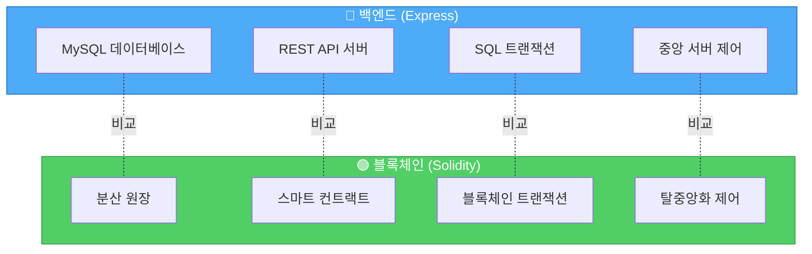
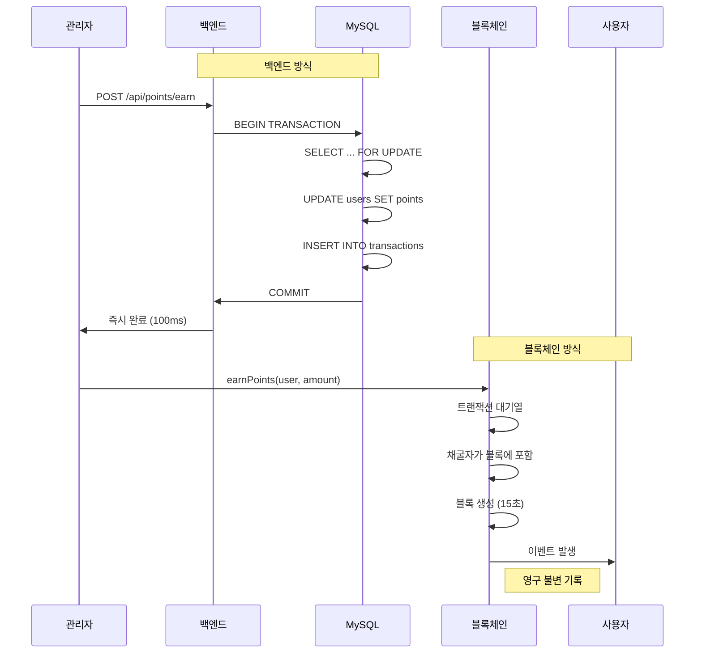
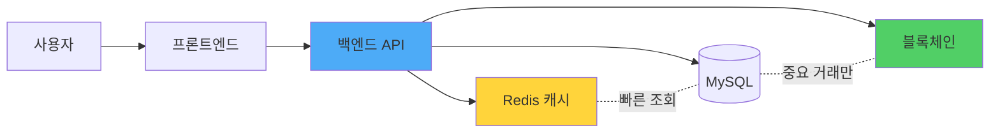

# 🔍 백엔드 vs 블록체인 코드 상세 비교

> 동일한 포인트 시스템을 **백엔드(Express + MySQL)**와 **블록체인(Solidity)**으로 구현한 코드를 한 줄씩 비교합니다.

---

## 📊 전체 비교 요약



---

## 1️⃣ 포인트 적립 비교

### 🔵 백엔드: SQL UPDATE

**파일**: `samples/backend/server.js:95-168`

```javascript
// POST /api/points/earn
app.post('/api/points/earn', async (req, res) => {
    const { userId, amount, description } = req.body;
    const connection = await pool.getConnection();

    try {
        // 트랜잭션 시작
        await connection.beginTransaction();

        // 1. 사용자 조회 (행 잠금)
        const [users] = await connection.query(
            'SELECT id, points FROM users WHERE id = ? FOR UPDATE',
            [userId]
        );

        const currentPoints = users[0].points;
        const newPoints = currentPoints + amount;

        // 2. 포인트 증가
        await connection.query(
            'UPDATE users SET points = ? WHERE id = ?',
            [newPoints, userId]
        );

        // 3. 거래 내역 기록
        await connection.query(
            'INSERT INTO point_transactions (user_id, amount, type, description, balance_after) VALUES (?, ?, ?, ?, ?)',
            [userId, amount, 'earn', description, newPoints]
        );

        // 커밋
        await connection.commit();

        res.json({ success: true, data: { balanceAfter: newPoints } });
    } catch (error) {
        // 에러 시 롤백
        await connection.rollback();
        res.status(500).json({ error: '포인트 적립 실패' });
    }
});
```

**특징:**
- ✅ 즉시 실행 (밀리초)
- ✅ 무료 (서버 비용만)
- ❌ 중앙 서버 필요
- ❌ 관리자가 DB 수정 가능
- ❌ 감사 추적 어려움

---

### 🟢 블록체인: Solidity mint()

**파일**: `samples/blockchain/contracts/LoyaltyToken.sol:92-116`

```solidity
/**
 * @dev 포인트 적립 (관리자만 가능)
 */
function earnPoints(
    address user,
    uint256 amount,
    string memory reason
) external onlyOwner {
    require(user != address(0), "Invalid address");
    require(amount > 0, "Amount must be greater than 0");

    // 최대 발행량 체크
    if (maxSupply > 0) {
        require(
            totalSupply() + amount <= maxSupply,
            "Exceeds max supply"
        );
    }

    // 포인트 민팅
    _mint(user, amount);

    // 통계 업데이트
    userStats[user].totalEarned += amount;
    userStats[user].earnCount += 1;

    emit PointsEarned(user, amount, reason, balanceOf(user));
}
```

**특징:**
- ✅ 영구 불변 기록
- ✅ 투명한 감사 추적
- ✅ 탈중앙화 (누구도 수정 불가)
- ❌ 가스비 필요 (~$0.50-$5)
- ❌ 느림 (15초~2분)

---

### 🔄 핵심 차이점 비교



---

## 2️⃣ 포인트 사용 비교

### 🔵 백엔드: SQL UPDATE (차감)

**파일**: `samples/backend/server.js:171-256`

```javascript
app.post('/api/points/spend', async (req, res) => {
    const { userId, amount, description } = req.body;
    const connection = await pool.getConnection();

    try {
        await connection.beginTransaction();

        // 1. 잔액 확인
        const [users] = await connection.query(
            'SELECT id, points FROM users WHERE id = ? FOR UPDATE',
            [userId]
        );

        const currentPoints = users[0].points;

        // 2. 잔액 부족 체크
        if (currentPoints < amount) {
            await connection.rollback();
            return res.status(400).json({
                error: '포인트 잔액이 부족합니다',
                available: currentPoints,
                required: amount
            });
        }

        const newPoints = currentPoints - amount;

        // 3. 포인트 차감
        await connection.query(
            'UPDATE users SET points = ? WHERE id = ?',
            [newPoints, userId]
        );

        // 4. 거래 내역 기록
        await connection.query(
            'INSERT INTO point_transactions VALUES (...)',
            [userId, amount, 'spend', description, newPoints]
        );

        await connection.commit();
        res.json({ success: true });
    } catch (error) {
        await connection.rollback();
        res.status(500).json({ error: '포인트 사용 실패' });
    }
});
```

---

### 🟢 블록체인: Solidity burn()

**파일**: `samples/blockchain/contracts/LoyaltyToken.sol:123-135`

```solidity
/**
 * @dev 포인트 사용 (사용자가 직접 호출)
 */
function spendPoints(uint256 amount, string memory reason) external {
    require(amount > 0, "Amount must be greater than 0");
    require(balanceOf(msg.sender) >= amount, "Insufficient balance");

    // 포인트 소각
    _burn(msg.sender, amount);

    // 통계 업데이트
    userStats[msg.sender].totalSpent += amount;
    userStats[msg.sender].spendCount += 1;

    emit PointsSpent(msg.sender, amount, reason, balanceOf(msg.sender));
}
```

**핵심 차이:**
| 항목 | 백엔드 | 블록체인 |
|------|--------|----------|
| **누가 호출?** | 서버 관리자 | **사용자 본인** |
| **인증 방법** | JWT, 세션 | **지갑 서명** |
| **취소 가능?** | ✅ (롤백 가능) | ❌ (불가역) |
| **중간자 공격** | 가능 (서버 해킹 시) | 불가능 |

---

## 3️⃣ 잔액 조회 비교

### 🔵 백엔드: SELECT 쿼리

```javascript
// GET /api/users/:userId
app.get('/api/users/:userId', async (req, res) => {
    const [users] = await pool.query(
        'SELECT id, username, email, points FROM users WHERE id = ?',
        [req.params.userId]
    );

    res.json({ data: users[0] });
});
```

---

### 🟢 블록체인: balanceOf()

```solidity
// ERC-20 표준 함수 (OpenZeppelin 제공)
function balanceOf(address account) public view returns (uint256) {
    return _balances[account];
}

// 사용자 통계 조회
function getUserStats(address user)
    external
    view
    returns (
        uint256 currentBalance,
        uint256 totalEarned,
        uint256 totalSpent,
        uint256 earnCount,
        uint256 spendCount
    )
{
    UserStats memory stats = userStats[user];
    return (
        balanceOf(user),
        stats.totalEarned,
        stats.totalSpent,
        stats.earnCount,
        stats.spendCount
    );
}
```

**특징:**
| 항목 | 백엔드 | 블록체인 |
|------|--------|----------|
| **비용** | 무료 | **무료 (view 함수)** |
| **속도** | ~10ms | ~100ms (RPC 호출) |
| **신뢰성** | 서버 응답 신뢰 | **온체인 데이터 검증** |

---

## 4️⃣ 거래 내역 비교

### 🔵 백엔드: MySQL 테이블

**스키마**: `samples/backend/database/schema.sql`

```sql
CREATE TABLE point_transactions (
    id INT PRIMARY KEY AUTO_INCREMENT,
    user_id INT NOT NULL,
    amount INT NOT NULL,
    type ENUM('earn', 'spend') NOT NULL,
    description VARCHAR(200),
    balance_after INT NOT NULL,
    created_at TIMESTAMP DEFAULT CURRENT_TIMESTAMP,
    FOREIGN KEY (user_id) REFERENCES users(id) ON DELETE CASCADE
);
```

**조회 코드**:
```javascript
app.get('/api/points/history/:userId', async (req, res) => {
    const [transactions] = await pool.query(
        `SELECT * FROM point_transactions
         WHERE user_id = ?
         ORDER BY created_at DESC
         LIMIT ? OFFSET ?`,
        [userId, limit, offset]
    );
    res.json({ data: { transactions } });
});
```

---

### 🟢 블록체인: 이벤트 로그

**이벤트 정의**: `LoyaltyToken.sol:44-62`

```solidity
event PointsEarned(
    address indexed user,
    uint256 amount,
    string reason,
    uint256 newBalance
);

event PointsSpent(
    address indexed user,
    uint256 amount,
    string reason,
    uint256 newBalance
);

event PointsTransferred(
    address indexed from,
    address indexed to,
    uint256 amount
);
```

**조회 방법** (JavaScript):
```javascript
// ethers.js로 이벤트 조회
const filter = contract.filters.PointsEarned(userAddress);
const events = await contract.queryFilter(filter);

events.forEach(event => {
    console.log(`적립: ${event.args.amount} 포인트`);
    console.log(`사유: ${event.args.reason}`);
    console.log(`잔액: ${event.args.newBalance}`);
});
```

---

### 🔄 저장 방식 비교

```mermaid
graph TB
    subgraph Backend["백엔드: MySQL 테이블"]
        B1[transactions 테이블]
        B2[id, user_id, amount, type]
        B3[관리자가 수정 가능]
        B4[백업 필요]
    end

    subgraph Blockchain["블록체인: 이벤트 로그"]
        C1[블록체인 로그]
        C2[indexed 파라미터로 검색]
        C3[영구 불변]
        C4[자동 복제 (모든 노드)]
    end

    B1-->B2-->B3-->B4
    C1-->C2-->C3-->C4

    style Backend fill:#ff6b6b,stroke:#c92a2a,color:#fff
    style Blockchain fill:#51cf66,stroke:#2f9e44,color:#fff
```

---

## 5️⃣ 권한 관리 비교

### 🔵 백엔드: 애플리케이션 로직

```javascript
// 미들웨어로 권한 체크
function requireAdmin(req, res, next) {
    if (!req.user || req.user.role !== 'admin') {
        return res.status(403).json({ error: '권한이 없습니다' });
    }
    next();
}

// 적립은 관리자만
app.post('/api/points/earn', requireAdmin, async (req, res) => {
    // 포인트 적립 로직...
});
```

**문제점:**
- ❌ 서버 코드를 수정하면 우회 가능
- ❌ DB에 직접 접근하면 권한 무시
- ❌ 내부자 공격에 취약

---

### 🟢 블록체인: 스마트 컨트랙트 제어자

```solidity
// OpenZeppelin Ownable 상속
contract LoyaltyToken is ERC20, Ownable {

    // onlyOwner 제어자: 컨트랙트 소유자만 실행 가능
    function earnPoints(
        address user,
        uint256 amount,
        string memory reason
    ) external onlyOwner {  // ← 이 한 줄로 권한 보장!
        _mint(user, amount);
        emit PointsEarned(user, amount, reason, balanceOf(user));
    }

    // 누구나 호출 가능 (본인 포인트만)
    function spendPoints(uint256 amount, string memory reason) external {
        _burn(msg.sender, amount);  // msg.sender = 호출자
        emit PointsSpent(msg.sender, amount, reason, balanceOf(msg.sender));
    }
}
```

**장점:**
- ✅ 코드 레벨에서 강제
- ✅ 누구도 우회 불가
- ✅ 소유권 이전 가능 (`transferOwnership`)

---

## 6️⃣ 트랜잭션 처리 비교

### 🔵 백엔드: MySQL 트랜잭션

```javascript
const connection = await pool.getConnection();

try {
    // 1. 트랜잭션 시작
    await connection.beginTransaction();

    // 2. 여러 쿼리 실행
    await connection.query('UPDATE users SET points = ?...', [newPoints]);
    await connection.query('INSERT INTO transactions...', [data]);

    // 3. 커밋 (성공)
    await connection.commit();

} catch (error) {
    // 4. 롤백 (실패)
    await connection.rollback();
    throw error;
}
```

**특성:**
- ✅ ACID 보장 (원자성, 일관성, 격리성, 지속성)
- ✅ 즉시 롤백 가능
- ❌ 단일 서버 의존
- ❌ 서버 다운 시 데이터 손실 가능

---

### 🟢 블록체인: 원자적 실행

```solidity
function earnPoints(address user, uint256 amount, string memory reason)
    external onlyOwner
{
    // 1. 검증
    require(user != address(0), "Invalid address");
    require(amount > 0, "Amount must be greater than 0");

    // 2. 실행 (모두 성공 or 모두 실패)
    _mint(user, amount);                    // ← 실패 시 전체 revert
    userStats[user].totalEarned += amount;  // ← 자동 롤백
    userStats[user].earnCount += 1;

    // 3. 이벤트 (성공 시에만 발생)
    emit PointsEarned(user, amount, reason, balanceOf(user));

    // 명시적 commit/rollback 불필요!
}
```

**특성:**
- ✅ 자동 롤백 (revert)
- ✅ 모든 노드에 복제
- ✅ 51% 공격 외에는 수정 불가
- ❌ 롤백 불가능 (배포 후)

---

## 7️⃣ 에러 처리 비교

### 🔵 백엔드: try-catch

```javascript
try {
    // 비즈니스 로직
    if (currentPoints < amount) {
        throw new Error('잔액 부족');
    }
    await connection.query('UPDATE...');
    res.json({ success: true });

} catch (error) {
    console.error('에러 발생:', error);
    res.status(500).json({
        success: false,
        error: error.message
    });
}
```

---

### 🟢 블록체인: require / revert

```solidity
function spendPoints(uint256 amount, string memory reason) external {
    // require: 조건 불만족 시 즉시 revert
    require(amount > 0, "Amount must be greater than 0");
    require(balanceOf(msg.sender) >= amount, "Insufficient balance");

    // 모든 상태 변경 자동 롤백
    _burn(msg.sender, amount);

    // revert 명시적 사용
    if (someCondition) {
        revert("Custom error message");
    }
}
```

**차이점:**
| 백엔드 | 블록체인 |
|--------|----------|
| 에러 로그 확인 필요 | 트랜잭션 실패 이유 온체인 기록 |
| 부분 실행 가능 | 전체 롤백 (원자성) |
| 재시도 가능 | 가스비 소모 (재시도 시 추가 비용) |

---

## 8️⃣ 배포 및 업그레이드

### 🔵 백엔드: 무중단 배포

```bash
# 1. 새 코드 배포
git pull origin main
npm install

# 2. DB 마이그레이션
npm run migrate

# 3. 서버 재시작 (무중단)
pm2 reload server

# 4. 롤백 가능
git checkout previous-version
pm2 reload server
```

**특징:**
- ✅ 언제든 수정 가능
- ✅ 버그 수정 즉시 배포
- ❌ 사용자가 변경 알 수 없음

---

### 🟢 블록체인: 불변 배포

```bash
# 1. 컨트랙트 배포 (최초 1회)
npx hardhat run scripts/deploy.js --network mainnet

# 출력: Contract deployed to: 0x1234...abcd
```

**특징:**
- ✅ 배포 후 코드 변경 불가
- ✅ 투명한 코드 (Etherscan 공개)
- ❌ 버그 수정 불가 (새 컨트랙트 배포 필요)

**업그레이드 패턴** (고급):
```solidity
// Proxy 패턴 사용 (OpenZeppelin)
contract LoyaltyTokenProxy {
    address implementation;  // 로직 컨트랙트 주소

    function upgrade(address newImplementation) external onlyOwner {
        implementation = newImplementation;
    }
}
```

---

## 9️⃣ 비용 비교

### 🔵 백엔드 운영 비용

| 항목 | 월 비용 (예상) |
|------|----------------|
| AWS EC2 (t3.small) | $15 |
| RDS MySQL (db.t3.micro) | $15 |
| 도메인 + SSL | $2 |
| 모니터링 (CloudWatch) | $5 |
| **총 월 비용** | **$37** |

**연간**: ~$450

---

### 🟢 블록체인 운영 비용

| 항목 | 비용 |
|------|------|
| 컨트랙트 배포 (1회) | $50-$200 (가스비) |
| 포인트 적립 (트랜잭션) | $0.50-$5 |
| 포인트 사용 (트랜잭션) | $0.50-$5 |
| 잔액 조회 | **무료** (view 함수) |
| 서버 비용 | **$0** (노드 운영자가 부담) |

**장단점:**
- ✅ 서버 유지 비용 0원
- ❌ 사용자마다 가스비 부담
- ✅ L2 사용 시 가스비 1/100 절감

---

## 🔟 성능 비교

```mermaid
gantt
    title 트랜잭션 처리 시간 비교
    dateFormat X
    axisFormat %L ms

    section 백엔드
    API 요청 처리    :0, 50
    DB 쿼리 실행     :50, 100
    응답 반환        :100, 120

    section 블록체인
    트랜잭션 제출    :0, 100
    Mempool 대기     :100, 5000
    블록 포함        :5000, 15000
    컨펌 대기        :15000, 30000
```



| 지표 | 백엔드 | 블록체인 (Ethereum) | 블록체인 (L2) |
|------|--------|---------------------|---------------|
| **처리 시간** | 100ms | 15-60초 | 1-3초 |
| **TPS** | 1000+ | 15-30 | 1000-4000 |
| **최종성** | 즉시 | 12개 블록 (~3분) | 즉시 (낙관적) |

---

## 📋 전체 비교 요약표

| 항목 | 백엔드 (Express + MySQL) | 블록체인 (Solidity) |
|------|--------------------------|---------------------|
| **개발 난이도** | ⭐⭐ 쉬움 | ⭐⭐⭐⭐ 어려움 |
| **처리 속도** | ⚡ 빠름 (100ms) | 🐢 느림 (15-60초) |
| **운영 비용** | 💰 월 $37 | 💸 트랜잭션당 $0.50-$5 |
| **투명성** | ❌ 서버만 접근 | ✅ 누구나 검증 가능 |
| **보안** | ⚠️ 서버 해킹 위험 | 🔒 51% 공격 외 안전 |
| **수정 가능성** | ✅ 언제든 수정 | ❌ 불변 (버그 수정 어려움) |
| **확장성** | 🚀 수직/수평 확장 | 📉 네트워크 제약 |
| **사용자 경험** | 😊 즉시 반응 | 😐 대기 시간 필요 |

---

## 🎯 언제 무엇을 사용할까?

### 🔵 백엔드를 선택해야 할 때

✅ **이런 경우에 추천:**
- 빠른 응답이 중요한 서비스 (실시간 게임, 채팅)
- 자주 변경되는 비즈니스 로직
- 개인정보 보호가 필요한 경우
- 가스비를 사용자가 부담할 수 없는 경우

**예시:**
- 일반 쇼핑몰 포인트
- 소셜 미디어 좋아요/팔로우
- 사내 복지 포인트

---

### 🟢 블록체인을 선택해야 할 때

✅ **이런 경우에 추천:**
- 투명성과 신뢰가 핵심인 서비스
- 중앙 관리자가 없어야 하는 경우
- 글로벌 사용자 간 P2P 거래
- 금융 상품 (토큰화된 자산)

**예시:**
- 암호화폐 거래
- NFT 마켓플레이스
- 탈중앙화 금융 (DeFi)
- 투표/거버넌스 시스템

---

### 🎨 하이브리드 아키텍처 (추천!)

실무에서는 **둘 다** 사용합니다!



**예시 시나리오:**
1. **포인트 적립** → 백엔드 DB에 즉시 기록 (빠름)
2. **일정 금액 이상** → 블록체인에도 기록 (신뢰)
3. **잔액 조회** → 캐시에서 조회 (초고속)
4. **정산** → 블록체인 기록 검증 후 실행

---

## 🎓 학습 경로 추천

### 1단계: 백엔드 마스터하기
```bash
cd samples/backend
npm install
# MySQL 설정 후
npm start
```

### 2단계: 블록체인 이해하기
```bash
cd samples/blockchain
npm install
npm test
```

### 3단계: 코드 비교하며 학습
- 같은 기능이 어떻게 다르게 구현되는지 분석
- 장단점 체험하기

### 4단계: 하이브리드 프로젝트 만들기
- 백엔드 + 블록체인 통합
- Webhook으로 연동
- 실무 수준 아키텍처 경험

---

## 📚 참고 자료

### 공식 문서
- [Express.js 공식 문서](https://expressjs.com/)
- [Solidity 문서 (한글)](https://solidity-kr.readthedocs.io/)
- [OpenZeppelin Contracts](https://docs.openzeppelin.com/contracts/)

### 추가 학습
- [CryptoZombies](https://cryptozombies.io/ko) - Solidity 게임 튜토리얼
- [Ethers.js 문서](https://docs.ethers.org/) - 블록체인 연동
- [Hardhat 공식 가이드](https://hardhat.org/tutorial) - 개발 환경

---

## ✨ 결론

**백엔드와 블록체인은 경쟁 관계가 아닙니다!**

- 🔵 **백엔드**: 빠르고 유연하며 저렴
- 🟢 **블록체인**: 투명하고 안전하며 탈중앙화

**최고의 선택:** 두 기술의 장점을 결합한 하이브리드 아키텍처! 🚀

---

**문서 버전**: 1.0
**최종 업데이트**: 2025-01-11
**관련 문서**:
- [블록체인_쉬운_설명_실전_비교.md](./블록체인_쉬운_설명_실전_비교.md)
- [블록체인_기초_완벽_가이드.md](./블록체인_기초_완벽_가이드.md)
- [GETTING_STARTED.md](./GETTING_STARTED.md)
