# 🚀 블록체인 학습 시작하기

> 이 가이드를 따라하면 **30분 안에** 블록체인 개발 환경을 구축하고 첫 스마트 컨트랙트를 배포할 수 있습니다!

---

## 📋 목차

1. [사전 준비](#1-사전-준비)
2. [문서 읽기](#2-문서-읽기)
3. [샘플 프로젝트 실행](#3-샘플-프로젝트-실행)
4. [다음 단계](#4-다음-단계)

---

## 1. 사전 준비

### 필수 설치 항목

#### ✅ Node.js (18 이상)
```bash
# 버전 확인
node --version  # v18.0.0 이상이어야 함

# 설치되지 않았다면
# https://nodejs.org 에서 다운로드
```

#### ✅ Git
```bash
# 버전 확인
git --version

# 설치되지 않았다면
# https://git-scm.com 에서 다운로드
```

#### ⚙️ MySQL (백엔드 샘플 실행 시 필요)
```bash
# MySQL 설치 확인
mysql --version

# 설치되지 않았다면
# https://dev.mysql.com/downloads/ 에서 다운로드
```

#### 🦊 MetaMask (블록체인 샘플 실행 시 필요)
- Chrome/Edge 확장 프로그램
- https://metamask.io 에서 설치
- 지갑 생성 및 Sepolia 테스트넷 추가

---

## 2. 문서 읽기

### 📚 추천 학습 순서

```mermaid
graph LR
    A[쉬운 설명] --> B[기초 가이드]
    B --> C[샘플 실행]
    C --> D[직접 개발]

    style A fill:#51cf66,stroke:#2f9e44,color:#fff
    style B fill:#4dabf7,stroke:#1971c2,color:#fff
    style C fill:#ffd43b,stroke:#fab005,color:#000
    style D fill:#ff6b6b,stroke:#c92a2a,color:#fff
```



### 1단계: 쉬운 설명부터 (1-2시간)

```bash
# VS Code에서 열기
code 블록체인_쉬운_설명_실전_비교.md
```

**이 문서에서 배우는 것:**
- ✅ 블록체인이 뭔지 일상 비유로 이해
- ✅ 은행 vs 블록체인 차이
- ✅ 백엔드 코드 vs 블록체인 코드 비교
- ✅ 실제 프로젝트 구조

### 2단계: 기초 완벽 가이드 (2-3시간)

```bash
# VS Code에서 열기
code 블록체인_기초_완벽_가이드.md
```

**이 문서에서 배우는 것:**
- ✅ 블록, 해시, 체인의 원리
- ✅ 채굴 프로세스
- ✅ 합의 알고리즘 (PoW, PoS)
- ✅ 트랜잭션 라이프사이클
- ✅ 지갑과 키 관리
- ✅ 스마트 컨트랙트

### 3단계: README (프로젝트 개요)

```bash
code README.md
```

---

## 3. 샘플 프로젝트 실행

### 선택하세요!

#### 옵션 A: 블록체인부터 (추천) ⭐

**이유:** 블록체인이 새로운 개념이니까요!

```bash
cd samples/blockchain
npm install
npm test
```

➡️ [블록체인 샘플 상세 가이드](#블록체인-샘플-상세)

#### 옵션 B: 백엔드부터

**이유:** 익숙한 것부터 시작하면 편해요!

```bash
cd samples/backend
npm install
npm start
```

➡️ [백엔드 샘플 상세 가이드](#백엔드-샘플-상세)

#### 옵션 C: 둘 다 병렬로

**이유:** 비교하면서 배우면 더 명확해요!

```bash
# 터미널 1
cd samples/backend && npm install && npm start

# 터미널 2
cd samples/blockchain && npm install && npm test
```

---

## 블록체인 샘플 상세

### 🎯 목표
- Solidity 스마트 컨트랙트 이해하기
- 로컬 블록체인에서 테스트하기
- 테스트넷에 배포하기

### 📝 단계별 실행

#### 1단계: 설치 및 컴파일

```bash
cd samples/blockchain

# 패키지 설치
npm install

# 컨트랙트 컴파일
npx hardhat compile
```

**출력 예상:**
```
Compiled 1 Solidity file successfully
```

#### 2단계: 테스트 실행

```bash
# 모든 테스트 실행
npm test

# 또는 Hardhat 직접 사용
npx hardhat test
```

**출력 예상:**
```
  LoyaltyToken Contract
    ✓ Should deploy with correct name and symbol
    ✓ Should mint points correctly
    ✓ Should transfer points
    ✓ Should spend points
    ... (15 tests passing)
```

#### 3단계: 로컬 네트워크에서 실행

```bash
# 터미널 1: 로컬 블록체인 실행
npx hardhat node

# 터미널 2: 로컬에 배포
npx hardhat run scripts/deploy.js --network localhost
```

**출력 예상:**
```
Deploying contracts...
LoyaltyToken deployed to: 0x5FbDB2315678afecb367f032d93F642f64180aa3
Owner address: 0xf39Fd6e51aad88F6F4ce6aB8827279cffFb92266
```

#### 4단계: 테스트넷 배포 (선택)

```bash
# .env 파일 설정
cp .env.example .env
# PRIVATE_KEY와 SEPOLIA_RPC_URL 입력

# Sepolia 테스트넷에 배포
npx hardhat run scripts/deploy.js --network sepolia
```

**필요한 것:**
1. MetaMask에서 Sepolia 테스트 ETH 받기
   - https://sepoliafaucet.com/
2. `.env` 파일에 개인키 입력 (⚠️ 절대 공개하지 마세요!)

### 📂 중요 파일들

| 파일 | 설명 |
|-----|------|
| `contracts/LoyaltyToken.sol` | 스마트 컨트랙트 코드 (250줄) |
| `test/LoyaltyToken.test.js` | 테스트 코드 (15개 테스트) |
| `scripts/deploy.js` | 배포 스크립트 |
| `hardhat.config.js` | Hardhat 설정 |

---

## 백엔드 샘플 상세

### 🎯 목표
- Express API 서버 이해하기
- MySQL 데이터베이스 연동
- REST API 테스트하기

### 📝 단계별 실행

#### 1단계: MySQL 설정

```bash
# MySQL 접속
mysql -u root -p

# 데이터베이스 생성
CREATE DATABASE loyalty_points;
USE loyalty_points;

# 테이블 생성 (schema.sql 실행)
source samples/backend/database/schema.sql;

# 또는 명령줄에서
mysql -u root -p loyalty_points < samples/backend/database/schema.sql
```

#### 2단계: 환경 변수 설정

```bash
cd samples/backend

# .env 파일 생성
cp .env.example .env
```

**`.env` 파일 내용 수정:**
```env
PORT=3000
DB_HOST=localhost
DB_USER=root
DB_PASSWORD=your_password
DB_NAME=loyalty_points
JWT_SECRET=your-secret-key
```

#### 3단계: 서버 실행

```bash
# 패키지 설치
npm install

# 서버 실행
npm start

# 또는 개발 모드 (자동 재시작)
npm run dev
```

**출력 예상:**
```
서버가 포트 3000에서 실행 중입니다
데이터베이스 연결 성공
```

#### 4단계: API 테스트

```bash
# 1. 모든 사용자 조회
curl http://localhost:3000/api/users

# 2. 포인트 적립
curl -X POST http://localhost:3000/api/points/earn \
  -H "Content-Type: application/json" \
  -d '{"userId": 1, "amount": 1000, "description": "회원가입 보너스"}'

# 3. 사용자 포인트 조회
curl http://localhost:3000/api/users/1

# 4. 거래 내역 조회
curl http://localhost:3000/api/points/history/1
```

### 📂 중요 파일들

| 파일 | 설명 |
|-----|------|
| `server.js` | Express 서버 (300줄) |
| `database/schema.sql` | 데이터베이스 스키마 |
| `.env` | 환경 변수 (⚠️ Git에 커밋하지 마세요!) |

---

## 4. 다음 단계

### ✅ 샘플 프로젝트를 실행했다면

#### 레벨 1: 코드 이해하기
```bash
# 스마트 컨트랙트 파일 열기
code samples/blockchain/contracts/LoyaltyToken.sol

# 백엔드 서버 파일 열기
code samples/backend/server.js
```

**비교하면서 보세요:**
- 포인트 적립: `UPDATE` vs `mint()`
- 포인트 사용: `UPDATE` vs `burn()`
- 잔액 조회: `SELECT` vs `balanceOf()`

#### 레벨 2: 코드 수정해보기

**백엔드 수정:**
```javascript
// server.js에서
// 새로운 API 엔드포인트 추가
app.get('/api/points/ranking', async (req, res) => {
  // 포인트 많은 순으로 사용자 조회
  const [users] = await pool.query(
    'SELECT username, points FROM users ORDER BY points DESC LIMIT 10'
  );
  res.json(users);
});
```

**블록체인 수정:**
```solidity
// LoyaltyToken.sol에서
// 새로운 함수 추가
function getTopHolders(uint limit) public view returns (address[] memory) {
    // 상위 보유자 조회 로직
}
```

#### 레벨 3: 나만의 프로젝트 만들기

**아이디어:**
1. **투표 시스템** - 블록체인 기반 전자 투표
2. **NFT 컬렉션** - 나만의 NFT 발행
3. **크라우드펀딩** - 스마트 컨트랙트로 펀딩
4. **탈중앙화 게시판** - IPFS + 블록체인

---

## 🆘 문제 해결

### 자주 발생하는 오류

#### Q1: "MODULE_NOT_FOUND" 오류
```bash
# 해결: 패키지 재설치
rm -rf node_modules package-lock.json
npm install
```

#### Q2: MySQL 연결 오류
```bash
# 해결: MySQL 실행 확인
# Windows
net start MySQL80

# Mac
brew services start mysql

# .env 파일의 DB 정보 확인
```

#### Q3: Hardhat 컴파일 오류
```bash
# 해결: Hardhat 캐시 삭제
npx hardhat clean
npx hardhat compile
```

#### Q4: 가스비 부족 (테스트넷)
```
# 해결: 테스트 ETH 받기
# Sepolia Faucet: https://sepoliafaucet.com/
# 또는 https://faucet.sepolia.dev/
```

---

## 📚 추가 학습 자료

### 공식 문서
- [Solidity 문서 (한글)](https://solidity-kr.readthedocs.io/)
- [Hardhat 문서](https://hardhat.org/docs)
- [ethers.js 문서](https://docs.ethers.org/)
- [OpenZeppelin 문서](https://docs.openzeppelin.com/)

### 온라인 튜토리얼
- [CryptoZombies](https://cryptozombies.io/ko) - 게임으로 배우는 Solidity
- [Ethereum.org](https://ethereum.org/ko/developers/) - 공식 개발자 가이드
- [Solidity by Example](https://solidity-by-example.org) - 예제 모음

### 유튜브 채널
- Patrick Collins (영어) - 최고의 Solidity 강의
- Dapp University (영어) - 초보자 친화적
- Alchemy (영어) - Web3 개발 전반

---

## 🎯 30일 학습 플랜

### 1주차: 기초 (이 저장소)
- [x] 문서 읽기
- [x] 샘플 프로젝트 실행
- [ ] 코드 이해하고 주석 달기
- [ ] 작은 수정 시도해보기

### 2주차: Solidity 심화
- [ ] CryptoZombies Lesson 1-6 완료
- [ ] ERC-20 토큰 직접 만들기
- [ ] 테스트 코드 작성 연습

### 3주차: DApp 개발
- [ ] React + ethers.js 연동
- [ ] MetaMask 연결
- [ ] 프론트엔드 완성

### 4주차: 프로젝트
- [ ] 나만의 DApp 기획
- [ ] 테스트넷 배포
- [ ] GitHub에 포트폴리오 업로드

---

## 💬 커뮤니티

### 질문하기
- **GitHub Issues**: 이 저장소의 이슈
- **Discord**: 블록체인 개발자 커뮤니티
- **Stack Overflow**: `solidity`, `ethereum` 태그

### 한국 커뮤니티
- 클레이튼 개발자 커뮤니티
- 이더리움 한국 사용자 모임
- 블록체인 개발자 오픈 카톡방

---

## ✨ 마무리

축하합니다! 🎉 블록체인 개발의 첫 걸음을 내딛었습니다!

**다음 단계:**
1. ⭐ 이 저장소에 Star 주기
2. 📝 학습 일지 작성하기
3. 💻 매일 조금씩 코딩하기
4. 🤝 커뮤니티 참여하기

**기억하세요:**
> "블록체인은 어렵지 않습니다. 단지 새로울 뿐이에요!" 🚀

---

**문서 버전:** 1.0
**최종 업데이트:** 2025-01-08
**문의:** GitHub Issues
