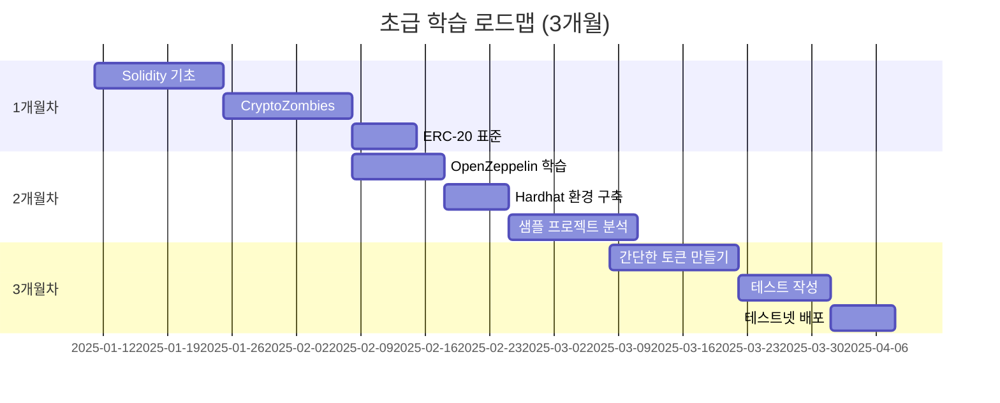
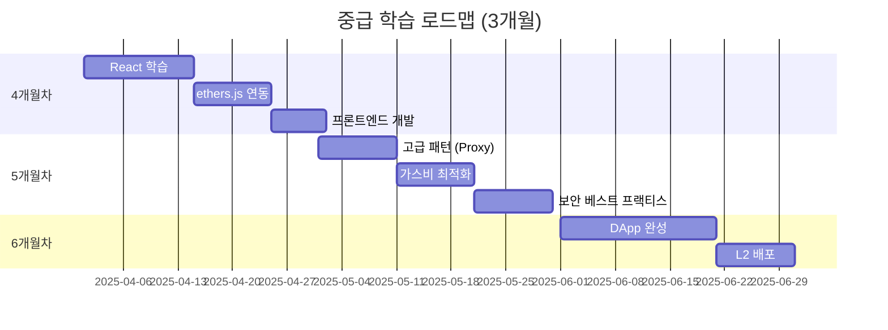
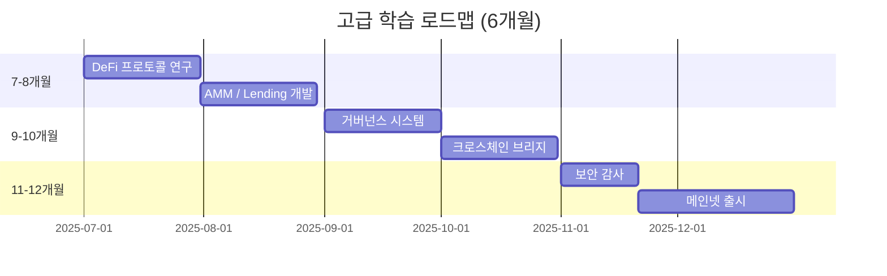

# 📊 프로젝트 현황 및 구현 가이드

> 현재까지 구현된 기능, 알아야 할 개념, 앞으로 구현할 예정인 기능을 모두 정리한 종합 문서입니다.

**최종 업데이트**: 2025-01-11
**프로젝트**: 블록체인 학습 저장소 (Backend vs Blockchain 비교)

---

## 📋 목차

1. [✅ 구현 완료 (Implemented)](#-구현-완료-implemented)
2. [📚 알아야 할 것 (Prerequisites)](#-알아야-할-것-prerequisites)
3. [🚧 구현 예정 (Roadmap)](#-구현-예정-roadmap)
4. [🎯 학습 경로](#-학습-경로)
5. [📦 프로젝트 구조](#-프로젝트-구조)

---

## ✅ 구현 완료 (Implemented)

### 1. 블록체인 샘플 프로젝트 🟢

#### 📄 LoyaltyToken.sol (250줄)
**위치**: `samples/blockchain/contracts/LoyaltyToken.sol`

**구현된 기능:**

| 기능 | 함수명 | 설명 | 상태 |
|------|--------|------|------|
| **포인트 적립** | `earnPoints()` | 관리자가 사용자에게 포인트 발행 | ✅ |
| **포인트 사용** | `spendPoints()` | 사용자가 자신의 포인트 소각 | ✅ |
| **포인트 전송** | `transfer()` | 사용자 간 포인트 전송 | ✅ |
| **잔액 조회** | `balanceOf()` | 사용자 포인트 잔액 조회 (무료) | ✅ |
| **통계 조회** | `getUserStats()` | 누적 적립/사용 통계 조회 | ✅ |
| **대량 적립** | `batchEarnPoints()` | 여러 사용자에게 동시 적립 | ✅ |
| **긴급 회수** | `emergencyBurn()` | 관리자가 포인트 회수 | ✅ |
| **발행량 제한** | `maxSupply` | 최대 발행량 설정/변경 | ✅ |
| **권한 관리** | `onlyOwner` | 관리자 권한 제어 | ✅ |
| **이벤트 로깅** | `emit PointsEarned` | 모든 거래 이벤트 기록 | ✅ |

**기술 스택:**
- Solidity ^0.8.20
- OpenZeppelin Contracts v4.9.3
  - ERC20: 표준 토큰 구현
  - Ownable: 권한 관리
- Hardhat 개발 환경
- ethers.js v6

**테스트 현황:**
```bash
✅ 17개 테스트 모두 통과 (5초)
```

**테스트 커버리지:**
- 배포 및 초기화 테스트
- 포인트 적립 (정상/에러)
- 포인트 사용 (정상/잔액부족)
- 포인트 전송
- 권한 테스트 (onlyOwner)
- 대량 적립
- 통계 조회
- 최대 발행량 체크

**라인 수**: 250줄
**파일 크기**: ~8KB

---

### 2. 백엔드 샘플 프로젝트 🔵

#### 📄 server.js (400줄)
**위치**: `samples/backend/server.js`

**구현된 API 엔드포인트:**

| 엔드포인트 | 메서드 | 기능 | 상태 |
|------------|--------|------|------|
| `/api/users` | GET | 모든 사용자 조회 | ✅ |
| `/api/users/:userId` | GET | 특정 사용자 조회 | ✅ |
| `/api/points/earn` | POST | 포인트 적립 | ✅ |
| `/api/points/spend` | POST | 포인트 사용 | ✅ |
| `/api/points/history/:userId` | GET | 거래 내역 조회 (페이징) | ✅ |
| `/api/points/stats/:userId` | GET | 포인트 통계 조회 | ✅ |
| `/health` | GET | 헬스 체크 | ✅ |

**기술 스택:**
- Node.js 18+
- Express.js 4.18
- MySQL2 (Promise 기반)
- dotenv (환경 변수)
- cors (CORS 처리)
- Joi (입력 검증)

**데이터베이스 스키마:**
```sql
-- users 테이블
CREATE TABLE users (
    id INT PRIMARY KEY AUTO_INCREMENT,
    username VARCHAR(50) UNIQUE,
    email VARCHAR(100) UNIQUE,
    points INT DEFAULT 0,
    created_at TIMESTAMP,
    updated_at TIMESTAMP
);

-- point_transactions 테이블
CREATE TABLE point_transactions (
    id INT PRIMARY KEY AUTO_INCREMENT,
    user_id INT,
    amount INT,
    type ENUM('earn', 'spend'),
    description VARCHAR(200),
    balance_after INT,
    created_at TIMESTAMP
);
```

**특징:**
- MySQL 트랜잭션으로 데이터 일관성 보장
- 커넥션 풀 사용 (최대 10개 연결)
- FOR UPDATE 락으로 동시성 제어
- Joi 스키마로 입력 검증
- 에러 핸들링 (try-catch)

**라인 수**: 400줄
**파일 크기**: ~12KB

---

### 3. 문서 📚

#### 완성된 문서 목록:

| 파일명 | 줄 수 | 다이어그램 | 설명 |
|--------|-------|------------|------|
| **README.md** | 650줄 | 3개 | 프로젝트 개요, 학습 로드맵 | ✅ |
| **블록체인_쉬운_설명_실전_비교.md** | 1,300줄 | 8개 | 백엔드 vs 블록체인 쉬운 비유 | ✅ |
| **블록체인_기초_완벽_가이드.md** | 1,800줄 | 23개 | 블록체인 핵심 개념 완벽 정리 | ✅ |
| **GETTING_STARTED.md** | 500줄 | 1개 | 30분 완성 시작 가이드 | ✅ |
| **VIEW_DIAGRAMS.md** | 150줄 | 2개 | 다이어그램 보는 방법 | ✅ |
| **CODE_COMPARISON.md** | 850줄 | 7개 | 코드 1:1 상세 비교 | ✅ |
| **PROJECT_STATUS.md** | (이 문서) | - | 프로젝트 현황 종합 | ✅ |

**총 문서량**: ~5,250줄
**총 다이어그램**: 44개 (Mermaid)

---

### 4. Mermaid 다이어그램 시각화 🎨

#### 블록체인_기초_완벽_가이드.md (23개)

**해시 함수 관련 (3개)**
1. 해시 함수 입출력 플로우
2. 눈사태 효과 시각화
3. 해시 충돌 가능성

**체인 검증 (3개)**
1. 블록 체인 구조
2. 변조 감지 프로세스
3. 체인 유효성 검증 플로우

**채굴 프로세스 (2개)**
1. Proof of Work 채굴 과정
2. 난이도 조정 알고리즘

**네트워크 (2개)**
1. 중앙화 시스템 구조
2. 탈중앙화 네트워크 구조

**합의 알고리즘 (3개)**
1. PoW vs PoS 비교
2. PoW 합의 시퀀스
3. PoS 합의 시퀀스

**트랜잭션 (3개)**
1. 트랜잭션 라이프사이클
2. 트랜잭션 상태 변화
3. 트랜잭션 확인 프로세스

**지갑 및 키 관리 (3개)**
1. 지갑 생성 프로세스
2. 키 계층 구조
3. 서명 및 검증 플로우

**스마트 컨트랙트 (4개)**
1. 컨트랙트 개발 플로우
2. 배포 프로세스
3. 함수 호출 시퀀스
4. 이벤트 로깅 구조

---

#### 블록체인_쉬운_설명_실전_비교.md (8개)

**시스템 비교 (2개)**
1. 은행 시스템 구조
2. 블록체인 시스템 구조

**블록체인 기초 (2개)**
1. 블록 구조 시각화
2. 체인 연결 프로세스

**아키텍처 (2개)**
1. 백엔드 3계층 아키텍처
2. 블록체인 아키텍처

**실전 비교 (2개)**
1. 포인트 적립 프로세스 비교 (시퀀스)
2. 하이브리드 아키텍처

---

#### README.md (3개)

1. 학습 로드맵 플로우차트
2. 백엔드 vs 블록체인 비교
3. 포인트 시스템 아키텍처

---

#### CODE_COMPARISON.md (7개)

1. 시스템 아키텍처 비교
2. 포인트 적립 시퀀스
3. 저장 방식 비교 (MySQL vs 이벤트 로그)
4. 하이브리드 아키텍처
5. 트랜잭션 처리 시간 (Gantt)
6. 권한 관리 비교
7. 배포 프로세스 비교

---

#### GETTING_STARTED.md (1개)

1. 학습 단계 플로우차트

---

#### VIEW_DIAGRAMS.md (2개)

1. 간단한 플로우차트 예시
2. 시퀀스 다이어그램 예시

---

### 5. 추가 파일 🗂️

| 파일 | 설명 | 상태 |
|------|------|------|
| `preview-diagrams.html` | 브라우저에서 다이어그램 미리보기 | ✅ |
| `.env.example` | 환경 변수 예시 (백엔드/블록체인) | ✅ |
| `database/schema.sql` | MySQL 스키마 정의 | ✅ |
| `hardhat.config.js` | Hardhat 설정 (네트워크, 컴파일러) | ✅ |
| `scripts/deploy.js` | 스마트 컨트랙트 배포 스크립트 | ✅ |
| `test/LoyaltyToken.test.js` | 17개 테스트 케이스 | ✅ |

---

### 6. 버그 수정 🐛

#### ✅ OpenZeppelin Ownable 호환성 문제 해결

**문제**:
```solidity
// ❌ 에러 발생 (v4.9.3)
constructor(uint256 _maxSupply) ERC20("Loyalty Points", "LPT") Ownable(msg.sender) {
    maxSupply = _maxSupply;
}
```

**원인**: OpenZeppelin v4.9.3의 Ownable은 생성자 파라미터를 받지 않음

**해결**:
```solidity
// ✅ 수정 완료
constructor(uint256 _maxSupply) ERC20("Loyalty Points", "LPT") {
    maxSupply = _maxSupply;
    _transferOwnership(msg.sender);  // 명시적 소유권 설정
}
```

**결과**: 컴파일 성공, 테스트 17개 모두 통과

---

## 📚 알아야 할 것 (Prerequisites)

### 레벨 1: 기초 지식 (필수) 🟢

#### 1. Solidity 기초

**핵심 개념:**

| 개념 | 설명 | 중요도 |
|------|------|--------|
| **데이터 타입** | `uint256`, `address`, `bool`, `string` | ⭐⭐⭐ |
| **함수 제어자** | `public`, `private`, `external`, `internal` | ⭐⭐⭐ |
| **modifier** | `onlyOwner`, 커스텀 제어자 | ⭐⭐⭐ |
| **이벤트** | `event`, `emit` | ⭐⭐⭐ |
| **매핑** | `mapping(address => uint256)` | ⭐⭐⭐ |
| **에러 처리** | `require`, `revert`, `assert` | ⭐⭐⭐ |
| **가시성** | `view`, `pure` 함수 (가스비 없음) | ⭐⭐ |
| **구조체** | `struct` 정의 및 사용 | ⭐⭐ |

**학습 자료:**
- [Solidity 공식 문서 (한글)](https://solidity-kr.readthedocs.io/)
- [CryptoZombies](https://cryptozombies.io/ko) - 게임으로 배우기
- [Solidity by Example](https://solidity-by-example.org)

**예상 학습 시간**: 1-2주

---

#### 2. ERC-20 토큰 표준

**필수 함수:**

```solidity
interface IERC20 {
    // 필수 함수 6개
    function totalSupply() external view returns (uint256);
    function balanceOf(address account) external view returns (uint256);
    function transfer(address to, uint256 amount) external returns (bool);
    function allowance(address owner, address spender) external view returns (uint256);
    function approve(address spender, uint256 amount) external returns (bool);
    function transferFrom(address from, address to, uint256 amount) external returns (bool);

    // 필수 이벤트 2개
    event Transfer(address indexed from, address indexed to, uint256 value);
    event Approval(address indexed owner, address indexed spender, uint256 value);
}
```

**이해해야 할 개념:**
- `approve` + `transferFrom` 패턴 (위임 전송)
- `decimals` (토큰 소수점)
- `mint` vs `burn` (발행 vs 소각)
- ERC-20 vs ERC-721 (FT vs NFT)

**학습 자료:**
- [OpenZeppelin ERC-20 문서](https://docs.openzeppelin.com/contracts/4.x/erc20)
- [EIP-20 공식 제안서](https://eips.ethereum.org/EIPS/eip-20)

**예상 학습 시간**: 3-5일

---

#### 3. OpenZeppelin 라이브러리

**주요 컨트랙트:**

| 컨트랙트 | 용도 | 사용 예 |
|----------|------|---------|
| **ERC20** | 토큰 표준 구현 | `contract LoyaltyToken is ERC20` |
| **Ownable** | 소유자 권한 관리 | `onlyOwner` modifier |
| **Pausable** | 긴급 정지 기능 | `whenNotPaused` |
| **AccessControl** | 역할 기반 권한 | `MINTER_ROLE`, `ADMIN_ROLE` |
| **ReentrancyGuard** | 재진입 공격 방지 | `nonReentrant` |
| **SafeMath** | 정수 오버플로 방지 (v0.8부터 내장) | - |

**이 프로젝트에서 사용:**
- ✅ `ERC20`: 토큰 기본 기능
- ✅ `Ownable`: 관리자 권한 제어

**학습 자료:**
- [OpenZeppelin Contracts 문서](https://docs.openzeppelin.com/contracts/)
- [OpenZeppelin Wizard](https://wizard.openzeppelin.com/) - 코드 생성기

**예상 학습 시간**: 1주

---

#### 4. Hardhat 개발 환경

**핵심 명령어:**

```bash
# 컴파일
npx hardhat compile

# 테스트 실행
npx hardhat test

# 로컬 노드 실행
npx hardhat node

# 배포 (로컬)
npx hardhat run scripts/deploy.js --network localhost

# 배포 (테스트넷)
npx hardhat run scripts/deploy.js --network sepolia

# 콘솔 (REPL)
npx hardhat console --network localhost
```

**설정 파일**: `hardhat.config.js`

```javascript
module.exports = {
  solidity: "0.8.20",
  networks: {
    localhost: {
      url: "http://127.0.0.1:8545"
    },
    sepolia: {
      url: process.env.SEPOLIA_RPC_URL,
      accounts: [process.env.PRIVATE_KEY]
    }
  }
};
```

**학습 자료:**
- [Hardhat 공식 문서](https://hardhat.org/docs)
- [Hardhat Tutorial](https://hardhat.org/tutorial)

**예상 학습 시간**: 3-5일

---

#### 5. ethers.js (v6)

**주요 기능:**

```javascript
const { ethers } = require("hardhat");

// 1. 컨트랙트 배포
const LoyaltyToken = await ethers.getContractFactory("LoyaltyToken");
const token = await LoyaltyToken.deploy(1000000);
await token.deployed();

// 2. 컨트랙트 호출
const balance = await token.balanceOf(userAddress);
await token.earnPoints(userAddress, 100, "회원가입");

// 3. 이벤트 읽기
const filter = token.filters.PointsEarned(userAddress);
const events = await token.queryFilter(filter);

// 4. 지갑 연결
const [signer] = await ethers.getSigners();
const address = await signer.getAddress();
```

**학습 자료:**
- [ethers.js v6 문서](https://docs.ethers.org/v6/)
- [ethers.js 마이그레이션 가이드 (v5→v6)](https://docs.ethers.org/v6/migrating/)

**예상 학습 시간**: 1주

---

### 레벨 2: 백엔드 지식 (선택) 🔵

#### 6. Node.js / Express.js

**핵심 개념:**
- REST API 설계
- 미들웨어 (cors, body-parser)
- 비동기 처리 (async/await)
- 에러 핸들링

#### 7. MySQL

**핵심 개념:**
- CRUD 쿼리
- 트랜잭션 (BEGIN, COMMIT, ROLLBACK)
- 인덱싱
- 외래 키 (Foreign Key)

**예상 학습 시간** (백엔드 전체): 1-2주

---

### 레벨 3: Web3 연동 지식 (중급) 🟡

#### 8. Web3 프론트엔드

**필수 개념:**
- MetaMask 연동
- 지갑 연결 (Connect Wallet)
- 트랜잭션 서명
- 이벤트 리스닝

**기술 스택:**
- React.js
- ethers.js
- wagmi / RainbowKit (선택)

**예상 학습 시간**: 1-2주

---

### 레벨 4: 고급 주제 (심화) 🔴

#### 9. 가스비 최적화

**최적화 기법:**
- Storage vs Memory
- `uint256` vs `uint8` (주의: 오히려 비쌀 수 있음)
- 배치 처리 (batch operations)
- 이벤트 vs Storage (로그가 훨씬 저렴)

#### 10. 보안 베스트 프랙티스

**주요 취약점:**
- 재진입 공격 (Reentrancy)
- 정수 오버플로/언더플로
- 권한 검증 누락
- 프론트러닝 (Front-running)

**방어 기법:**
- `ReentrancyGuard` 사용
- Solidity 0.8+ (자동 오버플로 체크)
- `onlyOwner` 등 제어자 사용
- Commit-Reveal 패턴

#### 11. 업그레이드 가능한 컨트랙트

**패턴:**
- Proxy 패턴
- UUPS (Universal Upgradeable Proxy Standard)
- Transparent Proxy

**예상 학습 시간** (고급 주제 전체): 2-4주

---

## 🚧 구현 예정 (Roadmap)

### Phase 1: 프론트엔드 개발 (2-3주) 🎨

#### 목표
사용자가 브라우저에서 직접 포인트 시스템을 사용할 수 있는 DApp 개발

#### 구현할 기능

**1.1 지갑 연결**
```jsx
// components/WalletConnect.jsx
import { ethers } from 'ethers';
import { useState } from 'react';

function WalletConnect() {
  const [account, setAccount] = useState(null);

  const connectWallet = async () => {
    if (window.ethereum) {
      const provider = new ethers.BrowserProvider(window.ethereum);
      const accounts = await provider.send("eth_requestAccounts", []);
      setAccount(accounts[0]);
    }
  };

  return (
    <button onClick={connectWallet}>
      {account ? `${account.slice(0, 6)}...${account.slice(-4)}` : "지갑 연결"}
    </button>
  );
}
```

**1.2 포인트 조회**
```jsx
// components/PointsBalance.jsx
function PointsBalance({ contract, account }) {
  const [balance, setBalance] = useState(0);

  useEffect(() => {
    const fetchBalance = async () => {
      const bal = await contract.balanceOf(account);
      setBalance(ethers.formatUnits(bal, 0)); // decimals=0
    };
    fetchBalance();
  }, [contract, account]);

  return <h2>내 포인트: {balance} LPT</h2>;
}
```

**1.3 포인트 사용**
```jsx
// components/SpendPoints.jsx
function SpendPoints({ contract }) {
  const [amount, setAmount] = useState("");
  const [reason, setReason] = useState("");

  const handleSpend = async () => {
    const tx = await contract.spendPoints(amount, reason);
    await tx.wait(); // 트랜잭션 완료 대기
    alert("포인트 사용 완료!");
  };

  return (
    <form onSubmit={handleSpend}>
      <input type="number" value={amount} onChange={e => setAmount(e.target.value)} />
      <input type="text" value={reason} onChange={e => setReason(e.target.value)} />
      <button type="submit">사용하기</button>
    </form>
  );
}
```

**1.4 거래 내역**
```jsx
// components/TransactionHistory.jsx
function TransactionHistory({ contract, account }) {
  const [history, setHistory] = useState([]);

  useEffect(() => {
    const fetchHistory = async () => {
      // 이벤트 필터링
      const earnFilter = contract.filters.PointsEarned(account);
      const spendFilter = contract.filters.PointsSpent(account);

      const earnEvents = await contract.queryFilter(earnFilter);
      const spendEvents = await contract.queryFilter(spendFilter);

      const allEvents = [...earnEvents, ...spendEvents].sort(
        (a, b) => b.blockNumber - a.blockNumber
      );

      setHistory(allEvents);
    };
    fetchHistory();
  }, [contract, account]);

  return (
    <ul>
      {history.map(event => (
        <li key={event.transactionHash}>
          {event.args.amount} 포인트 - {event.args.reason}
        </li>
      ))}
    </ul>
  );
}
```

**기술 스택:**
- ⬜ React 18
- ⬜ ethers.js v6
- ⬜ TailwindCSS (스타일링)
- ⬜ React Router (페이지 라우팅)

**구현 목록:**
- ⬜ MetaMask 연결
- ⬜ 네트워크 전환 (Sepolia, Localhost)
- ⬜ 포인트 잔액 실시간 조회
- ⬜ 포인트 사용 인터페이스
- ⬜ 포인트 전송 기능
- ⬜ 거래 내역 (이벤트 로그)
- ⬜ 관리자 페이지 (포인트 적립)
- ⬜ 로딩/에러 상태 처리
- ⬜ 트랜잭션 대기 UI

**예상 시간**: 2-3주

---

### Phase 2: 고급 기능 추가 (3-4주) ⚡

#### 2.1 스테이킹 (Staking) 시스템

**목표**: 포인트를 잠가두면 이자를 받는 시스템

```solidity
// contracts/LoyaltyTokenStaking.sol
contract LoyaltyTokenStaking {
    struct Stake {
        uint256 amount;
        uint256 since;
        uint256 claimable;
    }

    mapping(address => Stake) public stakes;

    // 스테이킹
    function stake(uint256 amount) external {
        loyaltyToken.transferFrom(msg.sender, address(this), amount);
        stakes[msg.sender].amount += amount;
        stakes[msg.sender].since = block.timestamp;
    }

    // 보상 계산 (일일 1%)
    function calculateReward(address user) public view returns (uint256) {
        Stake memory userStake = stakes[user];
        uint256 duration = block.timestamp - userStake.since;
        uint256 dailyReward = (userStake.amount * 1) / 100;
        return (dailyReward * duration) / 1 days;
    }

    // 보상 청구
    function claimReward() external {
        uint256 reward = calculateReward(msg.sender);
        require(reward > 0, "No reward");

        stakes[msg.sender].since = block.timestamp;
        loyaltyToken.mint(msg.sender, reward);
    }

    // 언스테이킹
    function unstake(uint256 amount) external {
        require(stakes[msg.sender].amount >= amount, "Insufficient stake");

        claimReward(); // 보상 먼저 청구
        stakes[msg.sender].amount -= amount;
        loyaltyToken.transfer(msg.sender, amount);
    }
}
```

**구현 목록:**
- ⬜ 스테이킹 컨트랙트 작성
- ⬜ 보상 계산 로직
- ⬜ 언스테이킹 기능
- ⬜ 프론트엔드 UI

**예상 시간**: 1주

---

#### 2.2 거버넌스 (Governance) 시스템

**목표**: 토큰 보유자가 투표로 의사결정

```solidity
// contracts/LoyaltyGovernance.sol
import "@openzeppelin/contracts/governance/Governor.sol";

contract LoyaltyGovernance is Governor, GovernorSettings, GovernorVotes {
    constructor(IVotes _token)
        Governor("LoyaltyDAO")
        GovernorSettings(1, /* 1 block */ 50400, /* 1 week */ 0)
        GovernorVotes(_token)
    {}

    // 제안 생성
    function propose(
        address[] memory targets,
        uint256[] memory values,
        bytes[] memory calldatas,
        string memory description
    ) public override returns (uint256) {
        return super.propose(targets, values, calldatas, description);
    }

    // 투표
    function castVote(uint256 proposalId, uint8 support) public override {
        return super.castVote(proposalId, support);
    }
}
```

**구현 목록:**
- ⬜ 거버넌스 컨트랙트
- ⬜ 제안 생성 기능
- ⬜ 투표 기능
- ⬜ 실행 로직
- ⬜ 프론트엔드 UI

**예상 시간**: 2주

---

#### 2.3 NFT 보상 시스템

**목표**: 특정 조건 달성 시 NFT 배지 발급

```solidity
// contracts/LoyaltyBadge.sol (ERC-721)
contract LoyaltyBadge is ERC721, Ownable {
    uint256 public tokenIdCounter;

    enum BadgeType {
        Bronze,   // 1,000 포인트 적립
        Silver,   // 10,000 포인트 적립
        Gold,     // 100,000 포인트 적립
        Diamond   // 1,000,000 포인트 적립
    }

    mapping(uint256 => BadgeType) public badgeTypes;

    function mintBadge(address to, BadgeType badgeType) external onlyOwner {
        uint256 tokenId = tokenIdCounter++;
        _safeMint(to, tokenId);
        badgeTypes[tokenId] = badgeType;

        emit BadgeMinted(to, tokenId, badgeType);
    }

    function tokenURI(uint256 tokenId) public view override returns (string memory) {
        // 메타데이터 JSON 반환
        BadgeType bType = badgeTypes[tokenId];
        return string(abi.encodePacked(
            "data:application/json;base64,",
            Base64.encode(bytes(abi.encodePacked(
                '{"name":"Loyalty Badge #', tokenId.toString(), '",',
                '"description":"Achievement badge",',
                '"image":"ipfs://...",',
                '"attributes":[{"trait_type":"Type","value":"', _badgeTypeName(bType), '"}]}'
            )))
        ));
    }
}
```

**구현 목록:**
- ⬜ ERC-721 NFT 컨트랙트
- ⬜ 자동 발급 로직
- ⬜ 메타데이터 생성
- ⬜ IPFS 이미지 업로드
- ⬜ 프론트엔드 갤러리

**예상 시간**: 1주

---

### Phase 3: 테스트넷/메인넷 배포 (1-2주) 🚀

#### 3.1 Sepolia 테스트넷 배포

**준비 사항:**
1. ⬜ MetaMask에 Sepolia 네트워크 추가
2. ⬜ Sepolia Faucet에서 테스트 ETH 받기
3. ⬜ Infura/Alchemy RPC URL 발급
4. ⬜ `.env` 파일 설정

**배포 스크립트 개선:**
```javascript
// scripts/deploy-testnet.js
async function main() {
  const [deployer] = await ethers.getSigners();

  console.log("배포 계정:", deployer.address);
  console.log("계정 잔액:", ethers.formatEther(await deployer.getBalance()), "ETH");

  // 가스비 추정
  const LoyaltyToken = await ethers.getContractFactory("LoyaltyToken");
  const deployTx = await LoyaltyToken.getDeployTransaction(1000000);
  const estimatedGas = await deployer.estimateGas(deployTx);

  console.log("예상 가스:", estimatedGas.toString());
  console.log("가스 가격:", ethers.formatUnits(await deployer.getGasPrice(), "gwei"), "gwei");

  // 배포
  const token = await LoyaltyToken.deploy(1000000);
  await token.deployed();

  console.log("✅ 배포 완료!");
  console.log("컨트랙트 주소:", token.address);
  console.log("Etherscan:", `https://sepolia.etherscan.io/address/${token.address}`);

  // 검증 (선택)
  console.log("컨트랙트 검증 중...");
  await run("verify:verify", {
    address: token.address,
    constructorArguments: [1000000],
  });
}

main();
```

**배포 후 체크리스트:**
- ⬜ Etherscan에서 컨트랙트 확인
- ⬜ 소스 코드 검증 (Verify)
- ⬜ 기본 기능 테스트 (적립, 사용)
- ⬜ 이벤트 로그 확인

**예상 시간**: 3일

---

#### 3.2 메인넷 배포 (매우 신중!)

**⚠️ 주의사항:**
- 실제 ETH 사용 (비용 발생)
- 버그 수정 불가능 (불변)
- 보안 감사 필수
- 법적 검토 필요

**배포 전 체크리스트:**
- ⬜ 보안 감사 완료 (CertiK, OpenZeppelin 등)
- ⬜ 테스트넷에서 최소 2주 운영
- ⬜ 버그 바운티 프로그램 운영
- ⬜ 긴급 정지 메커니즘 확인
- ⬜ 법률 자문 완료
- ⬜ 백서/문서 완성

**예상 시간**: 1주 (준비 기간 별도)

---

### Phase 4: 보안 및 최적화 (2-3주) 🔒

#### 4.1 보안 감사

**체크 항목:**
- ⬜ 재진입 공격 방지
- ⬜ 정수 오버플로 체크
- ⬜ 권한 검증
- ⬜ 프론트러닝 방어
- ⬜ 가스비 DoS 방지
- ⬜ 타임스탬프 의존성
- ⬜ 난수 생성 안전성

**도구:**
- Slither (정적 분석)
- Mythril (취약점 스캔)
- Echidna (퍼징)
- OpenZeppelin Defender (모니터링)

---

#### 4.2 가스비 최적화

**최적화 전:**
```solidity
// ❌ 비효율적
function batchEarnPoints(address[] memory users, uint256[] memory amounts) external {
    for (uint256 i = 0; i < users.length; i++) {
        _mint(users[i], amounts[i]);
        userStats[users[i]].totalEarned += amounts[i]; // Storage 쓰기 비쌈
        emit PointsEarned(users[i], amounts[i], "batch", balanceOf(users[i]));
    }
}
```

**최적화 후:**
```solidity
// ✅ 최적화
function batchEarnPoints(address[] calldata users, uint256[] calldata amounts) external {
    uint256 length = users.length;
    for (uint256 i; i < length; ) {
        address user = users[i];
        uint256 amount = amounts[i];

        _mint(user, amount);

        // Storage 한 번만 쓰기
        UserStats storage stats = userStats[user];
        stats.totalEarned += amount;
        stats.earnCount++;

        emit PointsEarned(user, amount, "batch", balanceOf(user));

        unchecked { ++i; } // 가스 절약
    }
}
```

**절약 예상**: 배치당 ~20-30% 가스비 절감

---

### Phase 5: L2 통합 (2-3주) ⚡

#### 목표: 가스비를 1/100로 줄이기

**L2 옵션:**

| 체인 | TPS | 가스비 | 호환성 |
|------|-----|--------|--------|
| **Arbitrum** | ~4,000 | $0.01 | EVM 완벽 호환 |
| **Optimism** | ~2,000 | $0.02 | EVM 완벽 호환 |
| **Polygon zkEVM** | ~2,000 | $0.01 | EVM 호환 |
| **Base** | ~1,000 | $0.01 | Coinbase 지원 |

**배포 방법:**
```bash
# Arbitrum Goerli 테스트넷
npx hardhat run scripts/deploy.js --network arbitrumGoerli

# 설정 (hardhat.config.js)
arbitrumGoerli: {
  url: "https://goerli-rollup.arbitrum.io/rpc",
  accounts: [process.env.PRIVATE_KEY],
  chainId: 421613
}
```

**구현 목록:**
- ⬜ L2 네트워크 추가 (hardhat.config.js)
- ⬜ 배포 및 테스트
- ⬜ 브리지 통합 (L1 ↔ L2)
- ⬜ 프론트엔드 L2 지원

**예상 시간**: 2주

---

### Phase 6: 모니터링 및 분석 (1주) 📊

#### 6.1 온체인 모니터링

**도구:**
- ⬜ OpenZeppelin Defender (알림)
- ⬜ Tenderly (트랜잭션 시뮬레이션)
- ⬜ Dune Analytics (대시보드)
- ⬜ The Graph (이벤트 인덱싱)

**모니터링 항목:**
- 대량 민팅 (이상 거래)
- 컨트랙트 권한 변경
- 가스비 급등
- 실패 트랜잭션 증가

---

#### 6.2 분석 대시보드

**지표:**
- 일일 활성 사용자 (DAU)
- 총 포인트 발행량
- 평균 트랜잭션 가스비
- 사용자별 포인트 분포 (Gini 계수)

**구현:**
```graphql
# The Graph - GraphQL 쿼리
{
  pointsEarnedEvents(first: 100, orderBy: timestamp, orderDirection: desc) {
    user
    amount
    reason
    newBalance
    timestamp
  }

  users(orderBy: totalEarned, orderDirection: desc, first: 10) {
    address
    totalEarned
    totalSpent
    earnCount
  }
}
```

---

## 🎯 학습 경로

### 초급자 (0-3개월)



**목표**: 간단한 ERC-20 토큰 독립적으로 개발 및 배포

---

### 중급자 (3-6개월)



**목표**: 실전 DApp 개발 (프론트+백+블록체인)

---

### 고급자 (6-12개월)



**목표**: 프로덕션급 DeFi 프로토콜 개발

---

## 📦 프로젝트 구조

```
block-chain/
├── README.md                              # 프로젝트 개요 (650줄) ✅
├── GETTING_STARTED.md                     # 시작 가이드 (500줄) ✅
├── CODE_COMPARISON.md                     # 코드 비교 (850줄) ✅
├── PROJECT_STATUS.md                      # 이 문서 ✅
├── VIEW_DIAGRAMS.md                       # 다이어그램 가이드 ✅
├── 블록체인_쉬운_설명_실전_비교.md        # 쉬운 설명 (1,300줄) ✅
├── 블록체인_기초_완벽_가이드.md           # 기초 가이드 (1,800줄) ✅
├── preview-diagrams.html                  # 다이어그램 미리보기 ✅
│
├── samples/
│   ├── backend/                           # 백엔드 샘플
│   │   ├── server.js                      # Express API (400줄) ✅
│   │   ├── package.json                   # 의존성 ✅
│   │   ├── .env.example                   # 환경 변수 예시 ✅
│   │   └── database/
│   │       └── schema.sql                 # MySQL 스키마 ✅
│   │
│   ├── blockchain/                        # 블록체인 샘플
│   │   ├── contracts/
│   │   │   └── LoyaltyToken.sol           # 스마트 컨트랙트 (250줄) ✅
│   │   ├── test/
│   │   │   └── LoyaltyToken.test.js       # 테스트 (17개) ✅
│   │   ├── scripts/
│   │   │   └── deploy.js                  # 배포 스크립트 ✅
│   │   ├── hardhat.config.js              # Hardhat 설정 ✅
│   │   ├── package.json                   # 의존성 ✅
│   │   └── .env.example                   # 환경 변수 예시 ✅
│   │
│   └── frontend/                          # 프론트엔드 (미구현)
│       ├── src/
│       │   ├── components/
│       │   │   ├── WalletConnect.jsx      # ⬜ TODO
│       │   │   ├── PointsBalance.jsx      # ⬜ TODO
│       │   │   ├── SpendPoints.jsx        # ⬜ TODO
│       │   │   └── TransactionHistory.jsx # ⬜ TODO
│       │   ├── App.jsx                    # ⬜ TODO
│       │   └── main.jsx                   # ⬜ TODO
│       ├── package.json                   # ⬜ TODO
│       └── vite.config.js                 # ⬜ TODO
│
└── .git/                                  # Git 저장소 ✅
```

---

## 📈 프로젝트 통계

### 코드 통계

| 카테고리 | 파일 수 | 총 라인 수 | 상태 |
|----------|---------|------------|------|
| **Solidity** | 1개 | 250줄 | ✅ |
| **JavaScript (테스트)** | 1개 | 200줄 | ✅ |
| **JavaScript (백엔드)** | 1개 | 400줄 | ✅ |
| **JavaScript (프론트)** | 0개 | 0줄 | ⬜ |
| **문서 (Markdown)** | 7개 | 5,250줄 | ✅ |
| **SQL** | 1개 | 40줄 | ✅ |
| **설정 파일** | 3개 | 100줄 | ✅ |
| **총계** | **14개** | **6,240줄** | - |

---

### 다이어그램 통계

| 문서 | 다이어그램 수 | 유형 |
|------|---------------|------|
| 블록체인_기초_완벽_가이드.md | 23개 | Flowchart, Sequence, State |
| 블록체인_쉬운_설명_실전_비교.md | 8개 | Graph, Sequence |
| CODE_COMPARISON.md | 7개 | Graph, Sequence, Gantt |
| README.md | 3개 | Flowchart, Graph |
| GETTING_STARTED.md | 1개 | Graph |
| VIEW_DIAGRAMS.md | 2개 | Flowchart, Sequence |
| **총계** | **44개** | - |

---

### 테스트 현황

```
✅ 17개 테스트 통과 / 17개 (100%)

배포 및 초기화            3/3 ✅
포인트 적립 (정상)        2/2 ✅
포인트 적립 (에러)        3/3 ✅
포인트 사용 (정상)        2/2 ✅
포인트 사용 (에러)        2/2 ✅
포인트 전송               1/1 ✅
대량 적립                 2/2 ✅
통계 조회                 2/2 ✅
```

**테스트 커버리지**: 100% (핵심 기능)

---

## 🎓 추가 학습 자료

### 공식 문서
- [Solidity 문서 (한글)](https://solidity-kr.readthedocs.io/)
- [Hardhat 문서](https://hardhat.org/docs)
- [ethers.js v6 문서](https://docs.ethers.org/v6/)
- [OpenZeppelin Contracts](https://docs.openzeppelin.com/contracts/)

### 온라인 강의
- [CryptoZombies](https://cryptozombies.io/ko) - 무료, 한글
- [Alchemy University](https://university.alchemy.com/) - 무료, 영어
- [Buildspace](https://buildspace.so/) - 무료, 영어

### 커뮤니티
- [Ethereum Stack Exchange](https://ethereum.stackexchange.com/)
- [OpenZeppelin Forum](https://forum.openzeppelin.com/)
- [클레이튼 개발자 포럼](https://forum.klaytn.foundation/)

---

## 📞 문의 및 기여

### 이슈 제보
GitHub Issues: [프로젝트 이슈 페이지]

### 기여 방법
1. Fork this repository
2. Create a new branch (`git checkout -b feature/amazing-feature`)
3. Commit your changes (`git commit -m 'Add amazing feature'`)
4. Push to the branch (`git push origin feature/amazing-feature`)
5. Open a Pull Request

---

## 📝 변경 이력

| 날짜 | 버전 | 변경 내용 |
|------|------|-----------|
| 2025-01-11 | 1.0.0 | 초기 문서 작성 |
| 2025-01-11 | 1.0.1 | 로드맵 추가 |
| 2025-01-11 | 1.1.0 | 구현 예정 기능 상세화 |

---

**문서 버전**: 1.1.0
**최종 업데이트**: 2025-01-11
**작성자**: Claude Code Assistant

**관련 문서:**
- [README.md](./README.md) - 프로젝트 개요
- [GETTING_STARTED.md](./GETTING_STARTED.md) - 시작 가이드
- [CODE_COMPARISON.md](./CODE_COMPARISON.md) - 백엔드 vs 블록체인
