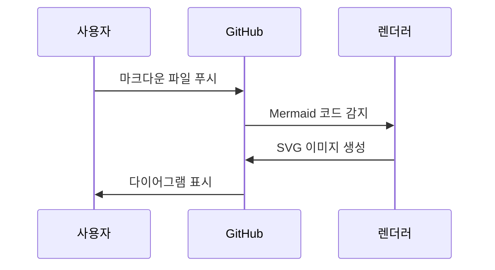

# 📊 다이어그램 확인 방법

이 프로젝트에는 Mermaid 다이어그램이 포함되어 있습니다. 아래 방법으로 확인하세요.

## 🚀 빠른 확인 방법

### 1. GitHub에서 확인 (가장 쉬움) ⭐

```bash
# 이 저장소를 GitHub에 푸시하면 자동으로 렌더링됨
git push origin main
```

GitHub에서 README.md나 다른 문서를 열면 다이어그램이 자동으로 표시됩니다!

---

## 💻 로컬에서 확인

### 방법 1: VS Code 확장 프로그램 설치

#### Option A: Markdown Preview Mermaid Support (가벼움)
1. VS Code 열기
2. `Ctrl + Shift + X` (확장 프로그램 창)
3. "Markdown Preview Mermaid Support" 검색
4. "설치" 클릭
5. 마크다운 파일 열고 `Ctrl + Shift + V`

#### Option B: Markdown Preview Enhanced (추천)
1. VS Code 열기
2. `Ctrl + Shift + X` (확장 프로그램 창)
3. "Markdown Preview Enhanced" 검색
4. "설치" 클릭
5. 마크다운 파일 우클릭 → "Markdown Preview Enhanced: Open Preview"
   또는 `Ctrl + K`, 그 다음 `V`

### 방법 2: 온라인 Mermaid 에디터

다이어그램 코드를 복사해서 온라인에서 확인:

**Mermaid Live Editor:**
- URL: https://mermaid.live/
- 왼쪽에 코드 붙여넣기
- 오른쪽에서 렌더링 결과 확인

**사용 예시:**
1. `블록체인_쉬운_설명_실전_비교.md` 파일 열기
2. ` ```mermaid` 블록의 코드 복사
3. https://mermaid.live/ 에 붙여넣기
4. 실시간으로 확인!

### 방법 3: Chrome/Edge 확장 프로그램

**Markdown Viewer** 확장 설치:
1. Chrome 웹 스토어에서 "Markdown Viewer" 검색
2. 설치
3. 로컬 .md 파일을 브라우저로 드래그

---

## 📝 다이어그램이 포함된 파일 목록

### 주요 문서:
- ✅ `README.md` - 프로젝트 개요, 학습 로드맵
- ✅ `블록체인_쉬운_설명_실전_비교.md` - 가장 많은 다이어그램 포함
- ✅ `블록체인_기초_완벽_가이드.md` - 아키텍처 다이어그램

### 포함된 다이어그램 종류:
1. **시스템 아키텍처** - 백엔드 vs 블록체인 구조
2. **프로세스 플로우** - 트랜잭션 처리 과정
3. **시퀀스 다이어그램** - 검증 과정
4. **학습 로드맵** - Gantt 차트
5. **하이브리드 아키텍처** - 실무 시스템 구조

---

## 🎨 다이어그램 예시

간단한 테스트를 해보세요:

### 테스트 1: 간단한 플로우차트


### 테스트 2: 시퀀스 다이어그램



위 코드를 https://mermaid.live/ 에 붙여넣어 보세요!

---

## ❓ 문제 해결

### Q: VS Code에서 다이어그램이 안 보여요
**A:** 확장 프로그램을 설치했나요?
- "Markdown Preview Enhanced" 또는
- "Markdown Preview Mermaid Support"

### Q: 온라인 에디터에서 에러가 나요
**A:** 코드 블록을 정확히 복사했는지 확인하세요:
```
```mermaid
... 여기 코드 ...
```
```

### Q: GitHub에 푸시했는데 안 보여요
**A:**
- GitHub는 Mermaid를 자동 지원합니다
- 캐시 문제일 수 있으니 새로고침 (Ctrl+F5)
- 파일이 `.md` 확장자인지 확인

---

## 🔗 유용한 링크

- [Mermaid 공식 문서](https://mermaid.js.org/)
- [Mermaid Live Editor](https://mermaid.live/)
- [GitHub Mermaid 지원](https://github.blog/2022-02-14-include-diagrams-markdown-files-mermaid/)
- [VS Code Markdown Preview Enhanced](https://shd101wyy.github.io/markdown-preview-enhanced/)

---

**⭐ 추천 방법:** GitHub에 푸시하면 가장 쉽게 확인할 수 있습니다!
