# 블록체인 기초 완벽 가이드

> 블록체인 개발자와 백엔드 개발자의 차이점, 그리고 블록체인 개발의 모든 것

---

## 목차
1. [블록체인이란 무엇인가?](#1-블록체인이란-무엇인가)
2. [블록(Block)의 구조](#2-블록block의-구조)
3. [해시(Hash) - 블록체인의 핵심 기술](#3-해시hash---블록체인의-핵심-기술)
4. [체인(Chain) - 블록들의 연결](#4-체인chain---블록들의-연결)
5. [채굴(Mining) - 작업 증명](#5-채굴mining---작업-증명)
6. [분산 네트워크 - 탈중앙화의 핵심](#6-분산-네트워크---탈중앙화의-핵심)
7. [합의 알고리즘 (Consensus)](#7-합의-알고리즘-consensus)
8. [트랜잭션 (Transaction)](#8-트랜잭션-transaction)
9. [지갑 (Wallet) - 키 관리](#9-지갑-wallet---키-관리)
10. [스마트 컨트랙트](#10-스마트-컨트랙트)
11. [블록체인 개발자 vs 백엔드 개발자](#11-블록체인-개발자-vs-백엔드-개발자)
12. [전체 시스템 흐름도](#12-전체-시스템-흐름도)
13. [핵심 개념 요약](#13-핵심-개념-요약)

---

## 1. 블록체인이란 무엇인가?

### 1.1 기본 아키텍처의 차이

#### 전통적인 백엔드 개발 (중앙화)

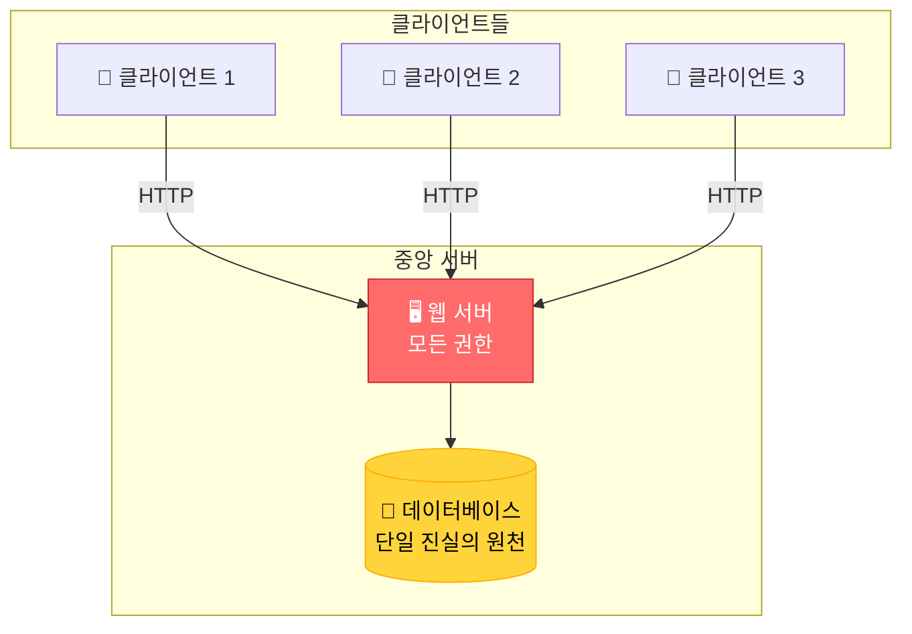

**특징:**
- 서버가 모든 권한을 가짐
- 데이터는 회사가 소유/관리
- 서버가 다운되면 서비스 중단
- Single Point of Failure

#### 블록체인 개발 (분산화)

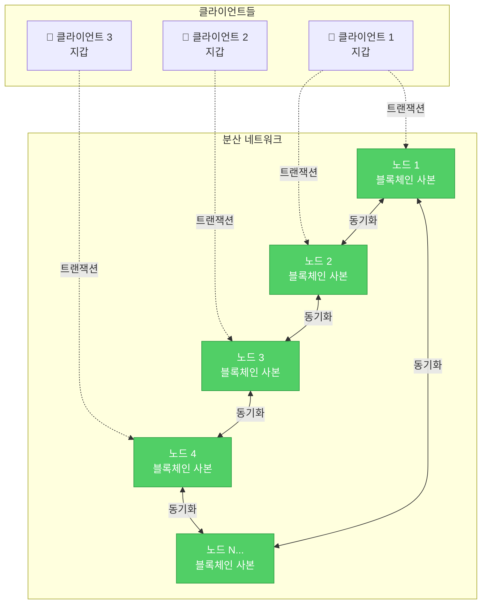

**특징:**
- 권한이 네트워크에 분산
- 데이터는 모든 노드가 공유
- 일부 노드가 다운되어도 서비스 유지
- No Single Point of Failure

### 1.2 비유로 이해하기

| 전통적인 시스템 (은행) | 블록체인 시스템 |
|----------------------|----------------|
| 은행 장부 1개 (은행만 보유) | 장부를 모든 사람이 복사본 보유 |
| 은행이 거래 승인 | 네트워크 참여자들이 함께 승인 |
| 은행을 신뢰해야 함 | 수학적 증명을 신뢰 |
| 은행이 장부 수정 가능 | 누구도 과거 기록 수정 불가 |

### 1.3 블록체인의 핵심 3요소

```
┌─────────────────────────────────────┐
│  1. 블록 (Block)                     │
│  - 거래 내역을 담는 상자             │
│  - 10분마다 하나씩 생성(비트코인)    │
└─────────────────────────────────────┘
           ↓ 체인으로 연결
┌─────────────────────────────────────┐
│  2. 체인 (Chain)                     │
│  - 블록들이 시간순으로 연결          │
│  - 이전 블록 정보를 담고 있음        │
└─────────────────────────────────────┘
           ↓ 복사본 공유
┌─────────────────────────────────────┐
│  3. 분산 네트워크 (Network)          │
│  - 모든 참여자가 같은 사본 보유      │
│  - 합의를 통해 진실 결정             │
└─────────────────────────────────────┘
```

---

## 2. 블록(Block)의 구조

### 2.1 블록 하나의 내부 구조

| 구성 요소 | 설명 | 예시 | 역할 |
|----------|------|------|------|
| **인덱스** | 블록 번호 | 1, 2, 3... | 블록 순서 식별 |
| **타임스탬프** | 생성 시간 | 2024-01-15 10:30:00 | 언제 만들어졌는지 |
| **데이터** | 실제 거래 내역 | "A가 B에게 10코인 전송" | 저장할 정보 |
| **이전 해시** | 이전 블록의 지문 | 0x7a8b9c... | 이전 블록과 연결 |
| **현재 해시** | 현재 블록의 지문 | 0x3d4e5f... | 현재 블록 식별 |
| **논스** | 채굴용 숫자 | 72534 | 작업증명에 사용 |

### 2.2 블록 구조 시각화

```
┌──────────────────────────────────────┐
│  블록 #1                              │
├──────────────────────────────────────┤
│  인덱스: 1                            │
│  타임스탬프: 2024-01-15 10:00:00     │
│  데이터: [거래1, 거래2, 거래3]        │
│  이전 해시: 0000000... (Genesis)     │
│  현재 해시: 00007a8b9c...            │
│  논스: 35293                          │
└──────────────────────────────────────┘
          ↓ (이전 해시로 연결)
┌──────────────────────────────────────┐
│  블록 #2                              │
├──────────────────────────────────────┤
│  인덱스: 2                            │
│  타임스탬프: 2024-01-15 10:10:00     │
│  데이터: [거래4, 거래5, 거래6]        │
│  이전 해시: 00007a8b9c... (블록#1)   │
│  현재 해시: 0000d4e5f6...            │
│  논스: 98472                          │
└──────────────────────────────────────┘
```

### 2.3 블록 구현 코드

```javascript
// 블록 클래스 - 가장 기본 단위
class Block {
    constructor(index, timestamp, data, previousHash = '') {
        this.index = index;              // 블록 번호
        this.timestamp = timestamp;      // 생성 시간
        this.data = data;                // 거래 데이터
        this.previousHash = previousHash; // 이전 블록 해시
        this.nonce = 0;                  // 채굴용 숫자
        this.hash = this.calculateHash(); // 현재 블록 해시
    }

    // 해시 계산 - 블록의 "지문" 만들기
    calculateHash() {
        return SHA256(
            this.index +
            this.previousHash +
            this.timestamp +
            JSON.stringify(this.data) +
            this.nonce
        ).toString();
    }
}

// 블록 생성 예시
const block1 = new Block(
    1,
    "2024-01-15 10:00:00",
    { from: "Alice", to: "Bob", amount: 10 },
    "0"
);

console.log(block1);
/*
{
  index: 1,
  timestamp: "2024-01-15 10:00:00",
  data: { from: "Alice", to: "Bob", amount: 10 },
  previousHash: "0",
  nonce: 0,
  hash: "7a8b9c2d3e4f5a6b7c8d9e0f1a2b3c4d..."
}
*/
```

---

## 3. 해시(Hash) - 블록체인의 핵심 기술

### 3.1 해시란 무엇인가?

해시는 임의의 데이터를 고정된 길이의 문자열로 변환하는 수학적 함수입니다.

#### 해시 함수 동작 원리

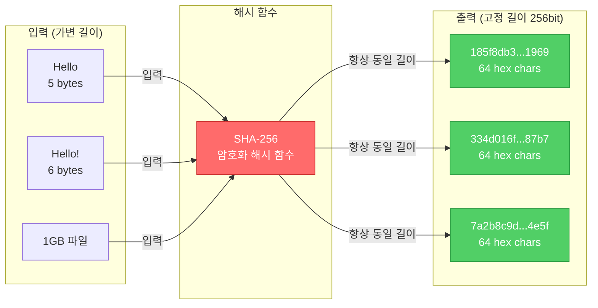

#### 눈사태 효과 (Avalanche Effect)

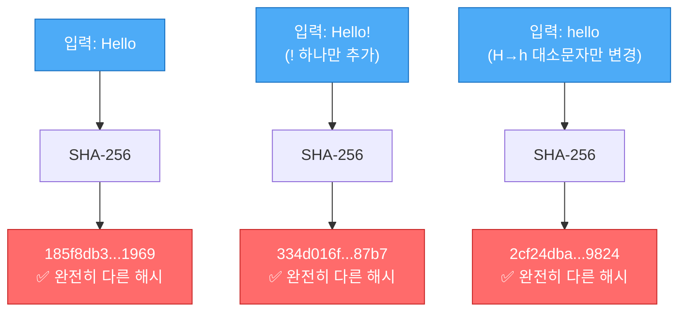

| 입력 데이터 | 해시 함수 | 해시 값 (출력) |
|------------|---------|---------------|
| "Hello" | SHA-256 → | 185f8db32271fe25f561a6fc938b2e264306ec304eda518007d1764826381969 |
| "Hello!" | SHA-256 → | 334d016f755cd6dc58c53a86e183882f8ec14f52fb05345887c8a5edd42c87b7 |
| "hello" | SHA-256 → | 2cf24dba5fb0a30e26e83b2ac5b9e29e1b161e5c1fa7425e73043362938b9824 |

### 3.2 해시의 특징

| 특징 | 설명 | 예시 |
|-----|------|------|
| **결정적** | 같은 입력 → 항상 같은 출력 | "Hello" → 항상 185f8db... |
| **빠른 계산** | 어떤 크기든 빠르게 해시 생성 | 1KB든 1GB든 즉시 계산 |
| **일방향** | 해시로 원본 복구 불가능 | 185f8db... → "Hello" 알 수 없음 |
| **눈사태 효과** | 1글자만 바뀌어도 완전히 다른 해시 | "Hello"와 "hello"의 해시 완전 다름 |
| **충돌 회피** | 다른 입력이 같은 해시 나올 확률 극히 낮음 | 사실상 불가능 |

### 3.3 해시 코드 예시

```javascript
const crypto = require('crypto');

// SHA-256 해시 함수
function hash(data) {
    return crypto.createHash('sha256').update(data).digest('hex');
}

// 테스트
console.log(hash("Hello"));
// 185f8db32271fe25f561a6fc938b2e264306ec304eda518007d1764826381969

console.log(hash("Hello!"));
// 334d016f755cd6dc58c53a86e183882f8ec14f52fb05345887c8a5edd42c87b7

console.log(hash("Hello"));
// 185f8db... (동일한 입력 = 동일한 출력)
```

### 3.4 블록체인에서 해시 사용 예시

```javascript
// 블록 데이터 변조 시도
const originalBlock = {
    index: 1,
    data: "Alice → Bob: 10코인",
    previousHash: "0x000abc",
    hash: "0x7a8b9c"  // 원래 해시
};

// 해커가 데이터 변조 시도
const tamperedBlock = {
    index: 1,
    data: "Alice → Hacker: 10코인",  // 데이터 변경!
    previousHash: "0x000abc",
    hash: "0x7a8b9c"  // 해시는 그대로
};

// 검증
function verifyBlock(block) {
    const calculatedHash = calculateHash(block.index, block.data, block.previousHash);
    return calculatedHash === block.hash;
}

verifyBlock(originalBlock);  // true - 정상
verifyBlock(tamperedBlock);  // false - 변조 감지!
```

---

## 4. 체인(Chain) - 블록들의 연결

### 4.1 체인이 만들어지는 과정

```
[블록 0: Genesis]
hash: 0x000abc
      ↓
[블록 1]
previousHash: 0x000abc ← 블록 0의 hash
hash: 0x111def
      ↓
[블록 2]
previousHash: 0x111def ← 블록 1의 hash
hash: 0x222ghi
      ↓
[블록 3]
previousHash: 0x222ghi ← 블록 2의 hash
hash: 0x333jkl
```

### 4.2 체인 검증 - 변조 감지 원리

#### 정상 체인

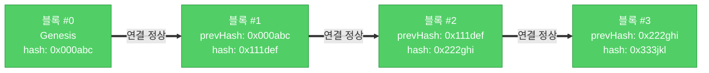

#### 블록 변조 시도 (실패)

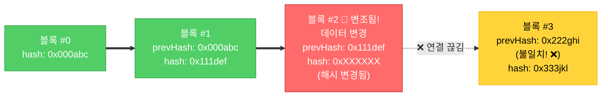

**변조 감지 과정:**

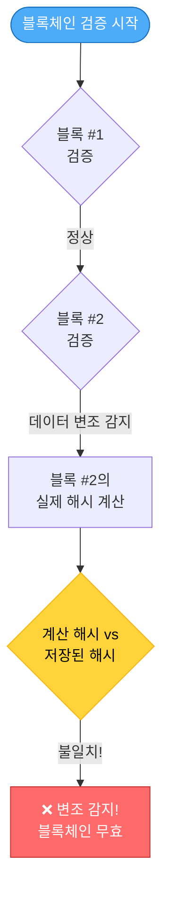

| 시나리오 | 결과 | 이유 |
|---------|------|------|
| 정상 체인 | ✅ 검증 통과 | 모든 해시 연결 정상 |
| 블록 2 데이터 변조 | ❌ 검증 실패 | 블록 2의 해시가 달라짐 |
| 블록 2 해시 재계산 | ❌ 검증 실패 | 블록 3의 previousHash와 불일치 |
| 블록 2~끝 모두 재계산 | ❌ 검증 실패 | 작업증명(PoW) 다시 필요 (엄청난 연산) |

### 4.3 체인 검증 코드

```javascript
class Blockchain {
    constructor() {
        this.chain = [this.createGenesisBlock()];
    }

    // 최초 블록 (Genesis Block)
    createGenesisBlock() {
        return new Block(0, "2024-01-01", "Genesis Block", "0");
    }

    // 마지막 블록 가져오기
    getLatestBlock() {
        return this.chain[this.chain.length - 1];
    }

    // 새 블록 추가
    addBlock(newBlock) {
        newBlock.previousHash = this.getLatestBlock().hash;
        newBlock.hash = newBlock.calculateHash();
        this.chain.push(newBlock);
    }

    // 체인 검증 - 핵심!
    isChainValid() {
        // Genesis 블록은 건너뛰고 블록 1부터 검증
        for (let i = 1; i < this.chain.length; i++) {
            const currentBlock = this.chain[i];
            const previousBlock = this.chain[i - 1];

            // 1. 현재 블록의 해시가 올바른지 확인
            if (currentBlock.hash !== currentBlock.calculateHash()) {
                console.log(`블록 ${i} 변조 감지!`);
                return false;
            }

            // 2. 이전 블록과 연결이 올바른지 확인
            if (currentBlock.previousHash !== previousBlock.hash) {
                console.log(`블록 ${i} 체인 연결 끊김!`);
                return false;
            }
        }

        return true;
    }
}

// 사용 예시
let myCoin = new Blockchain();
myCoin.addBlock(new Block(1, "2024-01-15", { from: "Alice", to: "Bob", amount: 10 }));
myCoin.addBlock(new Block(2, "2024-01-16", { from: "Bob", to: "Charlie", amount: 5 }));

console.log("체인 검증:", myCoin.isChainValid()); // true

// 변조 시도
myCoin.chain[1].data = { from: "Alice", to: "Hacker", amount: 1000 };

console.log("체인 검증:", myCoin.isChainValid()); // false - 변조 감지!
```

---

## 5. 채굴(Mining) - 작업 증명

### 5.1 채굴이란?

| 개념 | 설명 |
|-----|------|
| **목적** | 새 블록을 생성하고 체인에 추가할 권한 얻기 |
| **방법** | 특정 조건을 만족하는 해시 찾기 (난이도 퍼즐 풀기) |
| **조건 예시** | 해시가 "0000"으로 시작해야 함 |
| **난이도** | "0"의 개수로 조절 (0이 많을수록 어려움) |
| **보상** | 블록 생성 성공 시 코인 받음 |

### 5.2 채굴 난이도 비교

| 난이도 | 조건 | 평균 시도 횟수 | 예시 해시 |
|-------|------|---------------|----------|
| 1 | 0으로 시작 | ~16회 | **0**7a8b9c2d3e... |
| 2 | 00으로 시작 | ~256회 | **00**8b9c2d3e... |
| 3 | 000으로 시작 | ~4,096회 | **000**9c2d3e... |
| 4 | 0000으로 시작 | ~65,536회 | **0000**c2d3e... |
| 비트코인 | 약 19개의 0 | 수조 회 | **0000000000000000000**7a8... |

### 5.3 채굴 프로세스 시각화

#### 채굴 과정 (Proof of Work)

```mermaid
flowchart TD
    Start([새 블록 데이터 준비]) --> Init[nonce = 0]
    Init --> Hash1[해시 계산]
    Hash1 --> Check1{해시가<br/>0000으로<br/>시작?}

    Check1 -->|❌ No: 0x7a8b9c...| Inc1[nonce++]
    Inc1 --> Hash2[해시 재계산]
    Hash2 --> Check2{해시가<br/>0000으로<br/>시작?}

    Check2 -->|❌ No: 0x3d4e5f...| Inc2[nonce++]
    Inc2 --> Hash3[해시 재계산]
    Hash3 --> Check3{해시가<br/>0000으로<br/>시작?}

    Check3 -->|❌ No: 0x9c8d7b...| Inc3["nonce++<br/>수천~수백만번 반복..."]
    Inc3 --> HashN[해시 재계산]
    HashN --> CheckN{해시가<br/>0000으로<br/>시작?}

    CheckN -->|✅ Yes: 0x00007a8b...| Success[블록 생성 성공!<br/>nonce = 35293]
    Success --> Broadcast[네트워크에 전파]
    Broadcast --> Reward[💰 보상 받기<br/>비트코인: 6.25 BTC]

    style Start fill:#4dabf7,stroke:#1971c2,color:#fff
    style Check1 fill:#ffd43b,stroke:#fab005,color:#000
    style Check2 fill:#ffd43b,stroke:#fab005,color:#000
    style Check3 fill:#ffd43b,stroke:#fab005,color:#000
    style CheckN fill:#ffd43b,stroke:#fab005,color:#000
    style Success fill:#51cf66,stroke:#2f9e44,color:#fff
    style Reward fill:#51cf66,stroke:#2f9e44,color:#fff
```

#### 채굴 난이도에 따른 시도 횟수

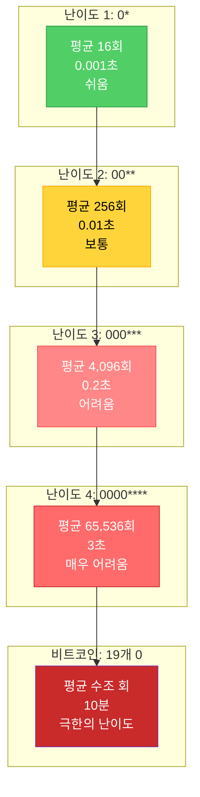

### 5.4 채굴 코드 구현

```javascript
class Block {
    // ... 이전 코드 ...

    // 채굴 함수
    mineBlock(difficulty) {
        // 목표: 해시가 difficulty개의 0으로 시작하게 만들기
        const target = "0".repeat(difficulty);

        console.log(`채굴 시작... 목표: ${target}...`);

        let attempts = 0;

        // 조건 만족할 때까지 반복
        while (this.hash.substring(0, difficulty) !== target) {
            this.nonce++;  // nonce 1씩 증가
            this.hash = this.calculateHash();  // 해시 재계산
            attempts++;

            // 진행 상황 출력 (1000번마다)
            if (attempts % 1000 === 0) {
                console.log(`시도 ${attempts}회... 현재 해시: ${this.hash}`);
            }
        }

        console.log(`✅ 채굴 성공! (${attempts}회 시도)`);
        console.log(`Nonce: ${this.nonce}`);
        console.log(`Hash: ${this.hash}`);
    }
}

// 채굴 테스트
const block = new Block(1, Date.now(), { from: "Alice", to: "Bob", amount: 10 });

console.log("\n=== 난이도 2 채굴 ===");
block.mineBlock(2);

console.log("\n=== 난이도 4 채굴 ===");
block.mineBlock(4);

/*
출력 예시:
=== 난이도 2 채굴 ===
채굴 시작... 목표: 00...
시도 1000회... 현재 해시: 7a8b9c2d3e4f...
✅ 채굴 성공! (243회 시도)
Nonce: 243
Hash: 008b9c2d3e4f5a6b...

=== 난이도 4 채굴 ===
채굴 시작... 목표: 0000...
시도 1000회... 현재 해시: 7a8b9c2d3e4f...
시도 2000회... 현재 해시: 3d4e5f6a7b8c...
...
시도 67000회... 현재 해시: 9c8d7b6a5e4f...
✅ 채굴 성공! (67234회 시도)
Nonce: 67234
Hash: 00007a8b9c2d3e4f...
*/
```

---

## 6. 분산 네트워크 - 탈중앙화의 핵심

### 6.1 중앙화 vs 탈중앙화

| 특성 | 중앙화 (은행) | 탈중앙화 (블록체인) |
|-----|-------------|------------------|
| **데이터 보관** | 중앙 서버 1곳 | 모든 노드가 복사본 보유 |
| **거래 승인** | 은행이 단독 결정 | 노드들이 투표로 결정 |
| **신뢰 대상** | 은행 | 수학적 알고리즘 |
| **장애 대응** | 서버 다운 시 서비스 중단 | 일부 노드 다운해도 정상 작동 |
| **검열 저항** | 은행이 거래 거부 가능 | 누구도 거래 막을 수 없음 |
| **투명성** | 은행 내부만 볼 수 있음 | 모두가 모든 거래 볼 수 있음 |

### 6.2 네트워크 구조 비교

#### 중앙화 네트워크 (Single Point of Failure)

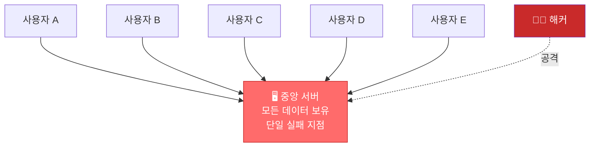

**위험:**
- 서버가 해킹되면 모든 데이터 노출
- 서버 다운 시 전체 서비스 중단
- 회사가 데이터 조작 가능

#### 탈중앙화 네트워크 (P2P)

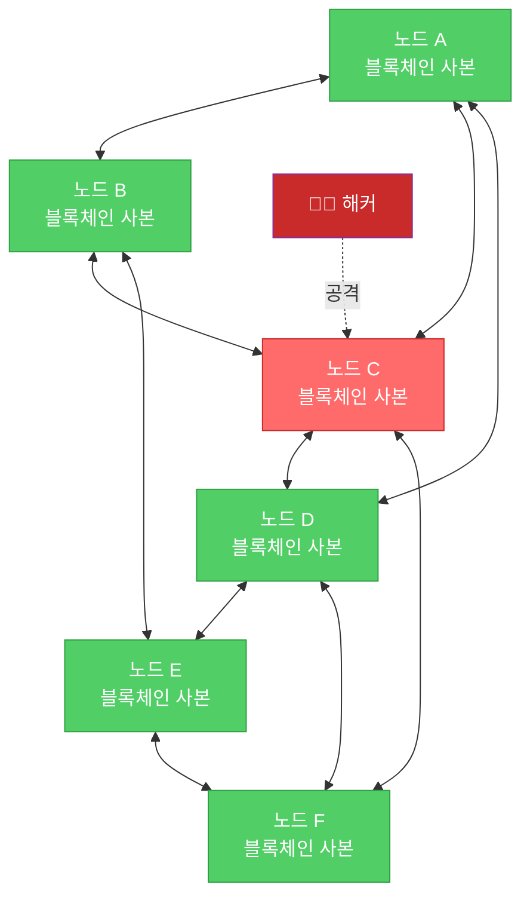

**안전:**
- 노드 하나 해킹되어도 다른 노드들이 검증
- 일부 노드 다운되어도 네트워크 정상 작동
- 데이터 변조하려면 51% 이상 노드 해킹 필요 (사실상 불가능)

---

## 7. 합의 알고리즘 (Consensus)

### 7.1 왜 합의가 필요한가?

| 상황 | 문제 | 해결 방법 |
|-----|------|----------|
| 같은 시간 2개 블록 생성 | 어떤 블록이 진짜? | 합의 알고리즘으로 결정 |
| 악의적인 노드 존재 | 잘못된 정보 전파 | 다수결 원칙 |
| 네트워크 지연 | 노드마다 다른 상태 | 가장 긴 체인 선택 |

### 7.2 주요 합의 알고리즘 비교

| 알고리즘 | 원리 | 장점 | 단점 | 사용 체인 |
|---------|------|------|------|----------|
| **PoW<br>(작업증명)** | 수학 퍼즐 먼저 푸는 사람 | 검증된 보안 | 전기 소모 엄청남 | Bitcoin, Ethereum(구) |
| **PoS<br>(지분증명)** | 코인 많이 보유한 사람 | 에너지 효율적 | 부자가 더 부유해짐 | Ethereum 2.0 |
| **DPoS<br>(위임지분증명)** | 대표자 투표로 선출 | 빠른 속도 | 중앙화 우려 | EOS, Tron |
| **PBFT<br>(실용비잔틴)** | 노드 2/3 이상 동의 | 즉시 확정 | 노드 수 제한 | Hyperledger |

### 7.3 PoW vs PoS 상세 비교

#### PoW (Proof of Work) - 작업증명

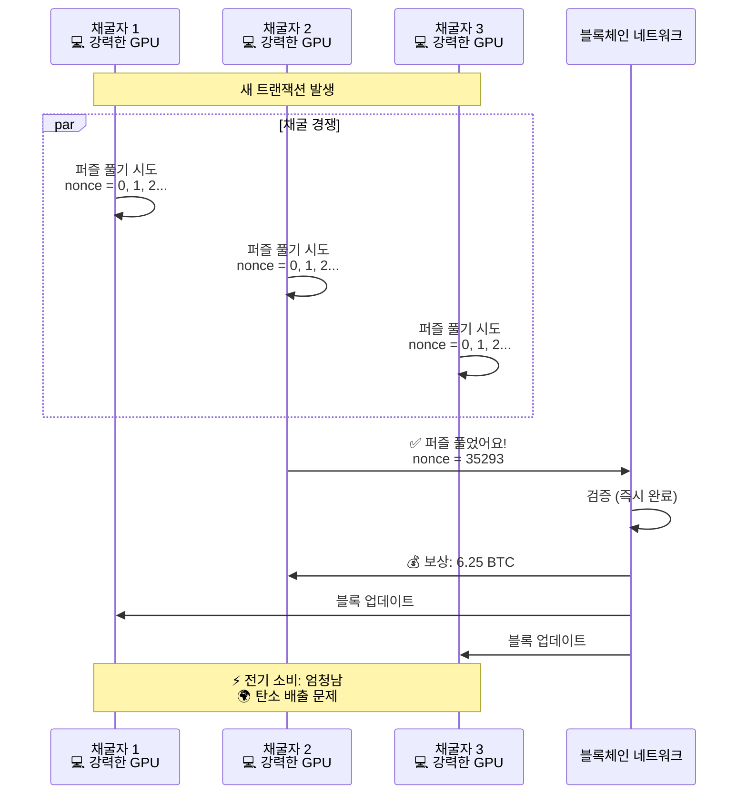

**특징:**
- ✅ 검증된 보안 (해킹 거의 불가능)
- ✅ 완전한 탈중앙화
- ❌ 연간 전기 소비: 작은 나라 수준
- ❌ 느린 속도 (비트코인: 10분/블록)

#### PoS (Proof of Stake) - 지분증명

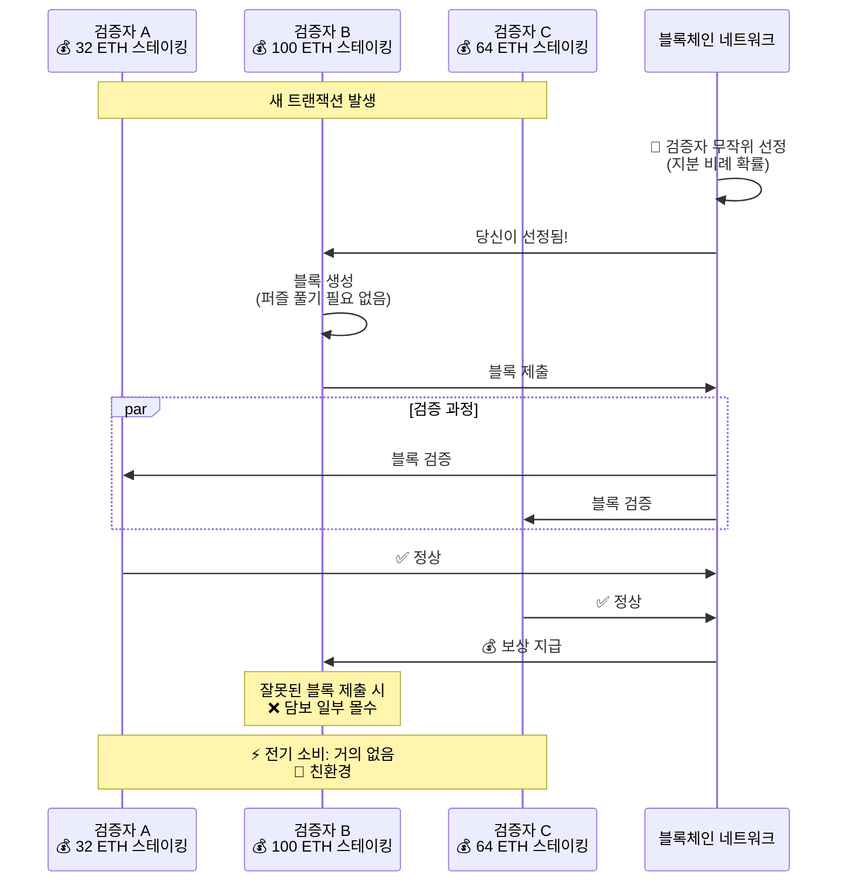

**특징:**
- ✅ 에너지 효율적 (전기 소비 99.95% 감소)
- ✅ 빠른 속도 (이더리움: 12초/블록)
- ❌ 부익부 (지분 많을수록 보상 많음)
- ❌ 완전한 탈중앙화는 아님

#### 비교표

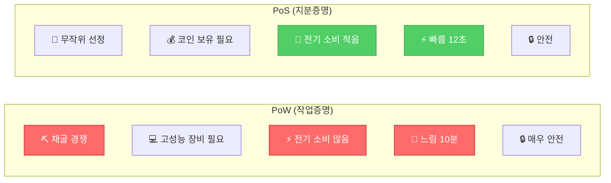

---

## 8. 트랜잭션 (Transaction)

### 8.1 트랜잭션 구조

| 필드 | 설명 | 예시 |
|-----|------|------|
| **from** | 보내는 주소 | 0x742d35Cc6634C0532925a3b844Bc9e7595f0bEb |
| **to** | 받는 주소 | 0x8888f1f195AFa192CfEE860698584c030f4c9dB1 |
| **amount** | 전송 금액 | 10.5 ETH |
| **timestamp** | 거래 시간 | 2024-01-15 10:30:00 |
| **signature** | 디지털 서명 | 0x3d4e5f... (소유자 증명) |
| **nonce** | 거래 순서 번호 | 42 |
| **gas** | 수수료 | 0.001 ETH |

### 8.2 트랜잭션 생명주기 (Transaction Lifecycle)

#### 전체 프로세스

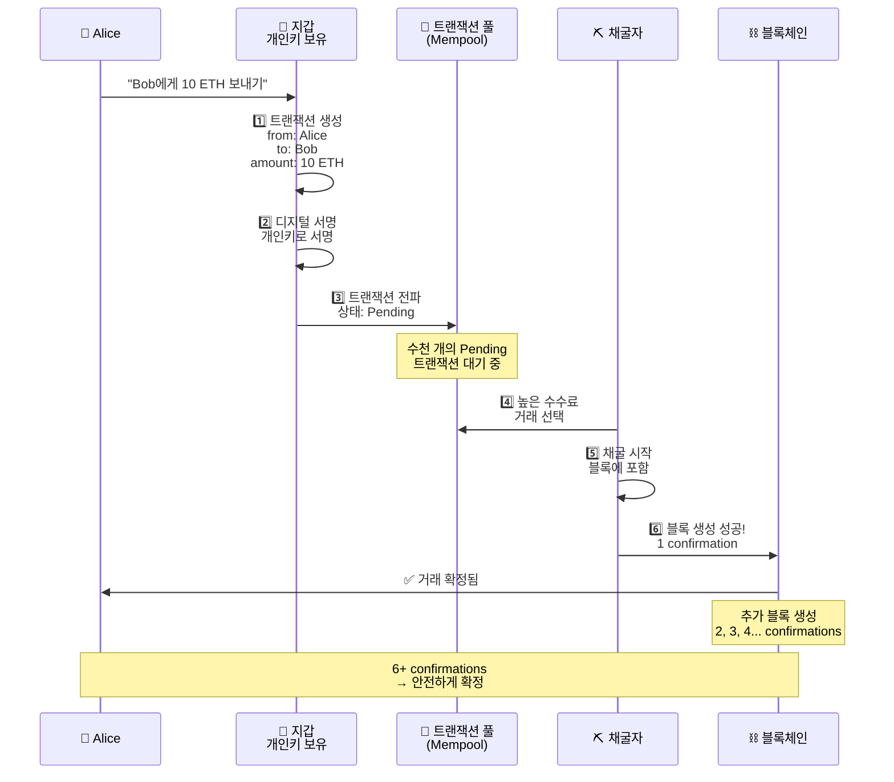

#### 트랜잭션 상태 변화

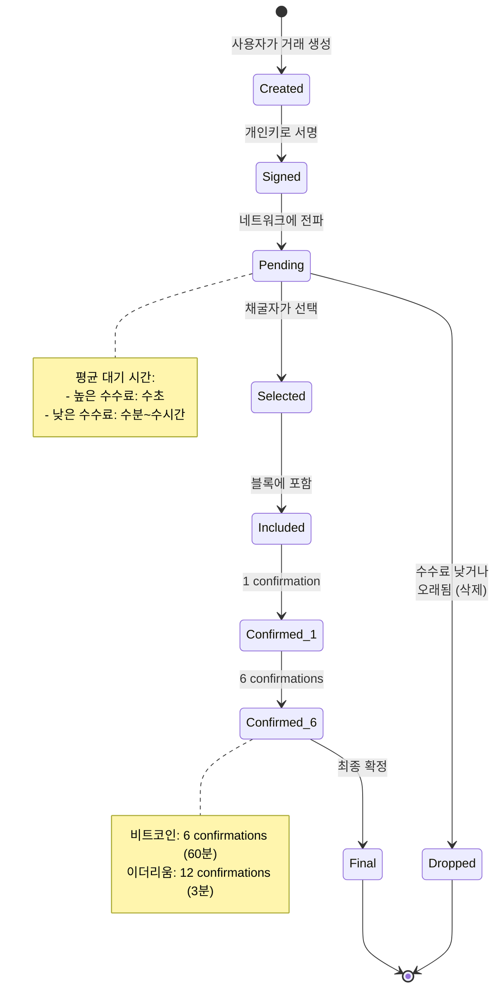

#### Confirmation 증가에 따른 안전도

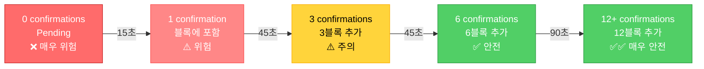

**확정도 기준:**
- **1 confirmation**: 블록에 포함됨 (약간 안전)
- **6 confirmations**: 비트코인 거래소 기준 (비교적 안전)
- **12+ confirmations**: 이더리움 고액 거래 기준 (매우 안전)

### 8.3 트랜잭션 코드 예시

```javascript
class Transaction {
    constructor(fromAddress, toAddress, amount) {
        this.fromAddress = fromAddress;
        this.toAddress = toAddress;
        this.amount = amount;
        this.timestamp = Date.now();
    }

    // 거래 해시 계산
    calculateHash() {
        return SHA256(
            this.fromAddress +
            this.toAddress +
            this.amount +
            this.timestamp
        ).toString();
    }

    // 디지털 서명 (간소화 버전)
    signTransaction(signingKey) {
        // 공개키가 from 주소와 일치하는지 확인
        if (signingKey.getPublic('hex') !== this.fromAddress) {
            throw new Error('다른 지갑의 거래에 서명할 수 없습니다!');
        }

        const hashTx = this.calculateHash();
        this.signature = signingKey.sign(hashTx, 'base64').toDER('hex');
    }

    // 서명 검증
    isValid() {
        // 채굴 보상은 서명 불필요
        if (this.fromAddress === null) return true;

        if (!this.signature || this.signature.length === 0) {
            throw new Error('거래에 서명이 없습니다!');
        }

        const publicKey = ec.keyFromPublic(this.fromAddress, 'hex');
        return publicKey.verify(this.calculateHash(), this.signature);
    }
}

// 사용 예시
const EC = require('elliptic').ec;
const ec = new EC('secp256k1');

// 지갑 생성
const myKey = ec.genKeyPair();
const myWalletAddress = myKey.getPublic('hex');

// 거래 생성
const tx = new Transaction(myWalletAddress, 'Bob주소', 10);

// 서명
tx.signTransaction(myKey);

// 검증
console.log('거래 유효성:', tx.isValid());  // true
```

---

## 9. 지갑 (Wallet) - 키 관리

### 9.1 공개키 vs 개인키

| 개념 | 비유 | 특성 | 예시 |
|-----|------|------|------|
| **개인키<br>(Private Key)** | 집 열쇠 | - 절대 공개 금지<br>- 코인 소유권 증명<br>- 분실 시 복구 불가 | 0xe8f32e... (64자리) |
| **공개키<br>(Public Key)** | 집 주소 | - 공개 가능<br>- 암호화에 사용<br>- 개인키로부터 생성 | 0x742d35... (130자리) |
| **주소<br>(Address)** | 간단한 주소 | - 공개키의 짧은 버전<br>- 코인 받을 때 사용 | 0x742d35Cc... (40자리) |

### 9.2 키 생성 과정

#### 지갑 생성 프로세스

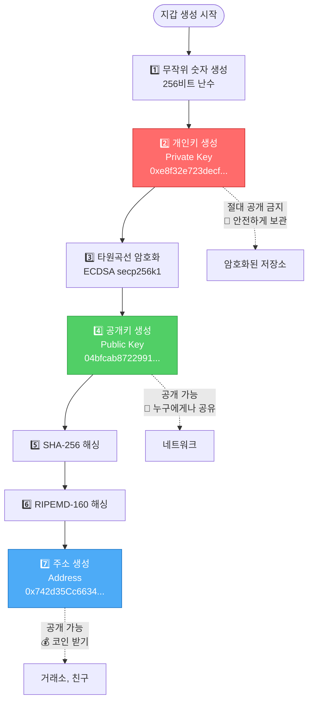

#### 키의 관계와 용도

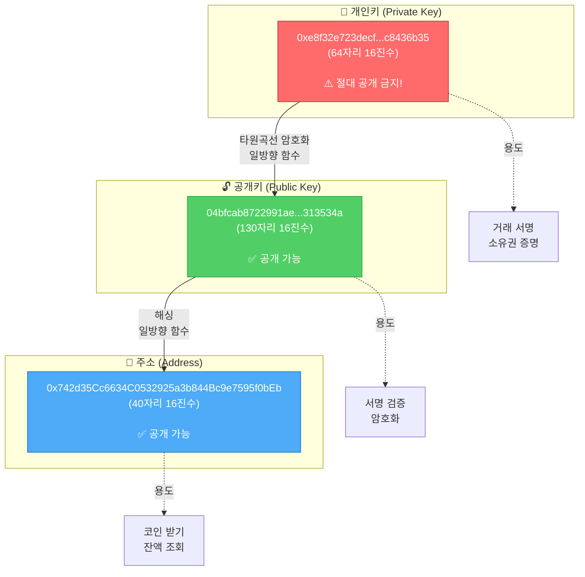

#### 개인키로 서명하는 과정

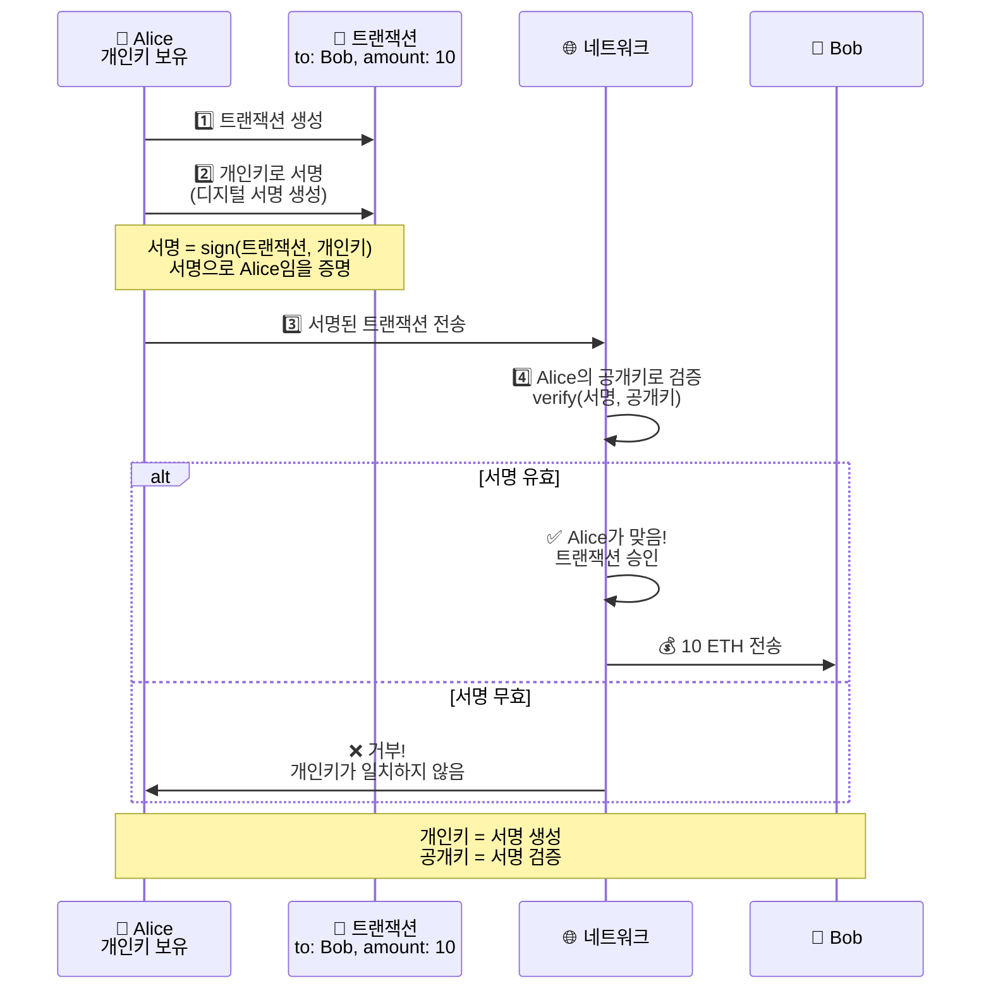

### 9.3 지갑 유형 비교

| 지갑 유형 | 설명 | 보안 | 편의성 | 예시 |
|---------|------|------|--------|------|
| **핫 월렛** | 인터넷 연결 | ⭐⭐ | ⭐⭐⭐⭐⭐ | MetaMask, Trust Wallet |
| **콜드 월렛** | 오프라인 저장 | ⭐⭐⭐⭐⭐ | ⭐⭐ | Ledger, Trezor |
| **종이 지갑** | 종이에 인쇄 | ⭐⭐⭐⭐ | ⭐ | 개인키 출력물 |
| **거래소 지갑** | 거래소 보관 | ⭐ | ⭐⭐⭐⭐⭐ | Binance, Coinbase |

### 9.4 지갑 코드 구현

```javascript
const EC = require('elliptic').ec;
const ec = new EC('secp256k1');  // Bitcoin/Ethereum이 사용하는 곡선

class Wallet {
    constructor() {
        // 1. 개인키 생성
        this.keyPair = ec.genKeyPair();
        this.privateKey = this.keyPair.getPrivate('hex');
        this.publicKey = this.keyPair.getPublic('hex');

        // 2. 주소 생성 (공개키의 해시)
        this.address = this.publicKey.substring(0, 40);
    }

    // 잔액 조회
    getBalance(blockchain) {
        let balance = 0;

        for (const block of blockchain.chain) {
            for (const trans of block.transactions) {
                if (trans.fromAddress === this.address) {
                    balance -= trans.amount;  // 보낸 금액
                }

                if (trans.toAddress === this.address) {
                    balance += trans.amount;  // 받은 금액
                }
            }
        }

        return balance;
    }

    // 거래 생성 및 서명
    sendMoney(toAddress, amount, blockchain) {
        const tx = new Transaction(this.address, toAddress, amount);
        tx.signTransaction(this.keyPair);

        blockchain.addTransaction(tx);

        return tx;
    }
}

// 사용 예시
const alice = new Wallet();
const bob = new Wallet();

console.log('Alice 지갑:');
console.log('  개인키:', alice.privateKey);
console.log('  주소:', alice.address);

console.log('\nBob 지갑:');
console.log('  주소:', bob.address);

// Alice가 Bob에게 송금
const tx = alice.sendMoney(bob.address, 10, blockchain);
console.log('\n거래 생성:', tx);
```

---

## 10. 스마트 컨트랙트

### 10.1 일반 계약 vs 스마트 컨트랙트

#### 비교표

| 구분 | 전통적 계약 | 스마트 컨트랙트 |
|-----|-----------|---------------|
| **형태** | 종이 문서 | 코드 |
| **실행** | 사람이 해석하고 이행 | 자동 실행 |
| **중개자** | 변호사, 법원 필요 | 불필요 |
| **비용** | 높음 (수수료, 시간) | 낮음 (가스비만) |
| **분쟁** | 법원 소송 | 코드가 절대 기준 |
| **투명성** | 비공개 가능 | 모두에게 공개 |
| **수정** | 합의 시 수정 가능 | 배포 후 수정 불가 |

#### 시각화

```mermaid
graph TB
    subgraph Traditional["전통적 계약"]
        direction TB
        T1[📄 종이 계약서 작성]
        T2[👨‍💼 변호사 검토]
        T3[✍️ 서명]
        T4[👤 사람이 직접 이행]
        T5[⚖️ 분쟁 시 법원]

        T1 --> T2 --> T3 --> T4
        T4 -.->|문제 발생| T5
    end

    subgraph Smart["스마트 컨트랙트"]
        direction TB
        S1[💻 코드 작성]
        S2[🔍 감사/검증]
        S3[🚀 블록체인 배포]
        S4[⚙️ 조건 충족 시 자동 실행]
        S5[✅ 분쟁 없음]

        S1 --> S2 --> S3 --> S4 --> S5
    end

    style T4 fill:#ff6b6b,stroke:#c92a2a,color:#fff
    style T5 fill:#ff6b6b,stroke:#c92a2a,color:#fff
    style S4 fill:#51cf66,stroke:#2f9e44,color:#fff
    style S5 fill:#51cf66,stroke:#2f9e44,color:#fff
```

### 10.2 스마트 컨트랙트 예시

#### 예시 1: 자판기 (가장 단순한 형태)

```
전통적 방식:
1. 돈 넣기
2. 버튼 누르기
3. 사람이 음료 건네기 ← 사람 개입
4. 거스름돈 받기

스마트 컨트랙트:
1. 돈 넣기
2. 버튼 누르기
3. 자동으로 음료 나옴 ← 자동 실행
4. 자동으로 거스름돈 나옴
```

#### 예시 2: 크라우드펀딩

```solidity
// Solidity 스마트 컨트랙트
contract Crowdfunding {
    address public creator;      // 프로젝트 생성자
    uint public goal;            // 목표 금액
    uint public deadline;        // 마감 시간
    uint public totalFunded;     // 현재 모금액

    mapping(address => uint) public contributions;  // 후원자별 금액

    // 후원하기
    function contribute() public payable {
        require(block.timestamp < deadline, "마감되었습니다");

        contributions[msg.sender] += msg.value;
        totalFunded += msg.value;
    }

    // 자동 정산 (목표 달성 시)
    function finalize() public {
        require(block.timestamp >= deadline, "아직 마감 전입니다");

        if (totalFunded >= goal) {
            // 목표 달성 → 생성자에게 전송
            payable(creator).transfer(totalFunded);
        } else {
            // 목표 실패 → 후원자들에게 환불 (자동!)
            // ... 환불 로직
        }
    }
}
```

**장점**:
- 목표 달성 여부 자동 판단
- 환불도 자동 처리
- 중개 플랫폼 불필요
- 수수료 절감

### 10.3 스마트 컨트랙트 개발 및 배포 과정

#### 전체 워크플로우

```mermaid
flowchart TD
    Start([개발 시작]) --> Write[1️⃣ Solidity 코드 작성<br/>MyToken.sol]

    Write --> Compile[2️⃣ 컴파일<br/>solc → Bytecode + ABI]

    Compile --> Test{3️⃣ 테스트<br/>Hardhat/Truffle}

    Test -->|실패| Fix[버그 수정]
    Fix --> Write

    Test -->|성공| Deploy[4️⃣ 배포<br/>Testnet/Mainnet]

    Deploy --> TxCreate[트랜잭션 생성<br/>data: bytecode]
    TxCreate --> TxSign[개인키로 서명]
    TxSign --> TxSend[네트워크에 전송]

    TxSend --> Mining[채굴자가 블록에 포함]
    Mining --> Deployed[5️⃣ 배포 완료!<br/>컨트랙트 주소 할당]

    Deployed --> Interact[6️⃣ 상호작용<br/>함수 호출]

    style Write fill:#4dabf7,stroke:#1971c2,color:#fff
    style Test fill:#ffd43b,stroke:#fab005,color:#000
    style Deployed fill:#51cf66,stroke:#2f9e44,color:#fff
    style Interact fill:#51cf66,stroke:#2f9e44,color:#fff
```

#### 배포 과정 상세

```mermaid
sequenceDiagram
    participant Dev as 👨‍💻 개발자
    participant Hardhat as ⚙️ Hardhat
    participant Wallet as 💼 MetaMask
    participant Network as 🌐 Ethereum Network
    participant Blockchain as ⛓️ 블록체인

    Dev->>Hardhat: 1️⃣ npx hardhat compile
    Hardhat->>Hardhat: Solidity → Bytecode 변환
    Hardhat->>Dev: ✅ 컴파일 완료<br/>artifacts/ 생성

    Dev->>Hardhat: 2️⃣ npx hardhat test
    Hardhat->>Hardhat: 테스트 실행
    Hardhat->>Dev: ✅ 15 passing

    Dev->>Hardhat: 3️⃣ npx hardhat run scripts/deploy.js
    Hardhat->>Wallet: MetaMask 연결 요청
    Wallet->>Dev: 확인 필요: 가스비 0.05 ETH
    Dev->>Wallet: ✅ 승인

    Hardhat->>Network: 배포 트랜잭션 전송<br/>data: bytecode

    Network->>Network: 트랜잭션 풀에 추가<br/>Pending...

    Network->>Blockchain: 채굴 완료<br/>블록 #12345에 포함

    Blockchain->>Hardhat: 📍 컨트랙트 주소<br/>0x5FbDB2315678afec...

    Hardhat->>Dev: 🎉 배포 성공!<br/>주소: 0x5FbDB...

    Note over Dev,Blockchain: 컨트랙트는 이제 영구적으로<br/>블록체인에 존재함 (수정 불가)
```

#### 로컬 vs 테스트넷 vs 메인넷

```mermaid
graph TB
    subgraph "1. 로컬 환경 (개발)"
        direction TB
        L1[Hardhat Network<br/>로컬 블록체인]
        L2[✅ 완전 무료]
        L3[✅ 빠른 테스트]
        L4[✅ 실수해도 안전]
    end

    subgraph "2. 테스트넷 (테스트)"
        direction TB
        T1[Sepolia/Goerli<br/>공개 테스트 네트워크]
        T2[✅ 무료 ETH<br/>Faucet에서 받기]
        T3[✅ 실제 환경 테스트]
        T4[⚠️ 느림 15초/블록]
    end

    subgraph "3. 메인넷 (프로덕션)"
        direction TB
        M1[Ethereum Mainnet<br/>실제 블록체인]
        M2[❌ 진짜 ETH 필요]
        M3[⚠️ 배포 후 수정 불가]
        M4[💰 가스비: $50~$500]
    end

    style L1 fill:#51cf66,stroke:#2f9e44,color:#fff
    style T1 fill:#ffd43b,stroke:#fab005,color:#000
    style M1 fill:#ff6b6b,stroke:#c92a2a,color:#fff
```

**배포 순서:**
1. **로컬**: 개발 및 초기 테스트
2. **테스트넷**: 실제 환경 테스트, 버그 수정
3. **메인넷**: 최종 배포 (돌이킬 수 없음!)

### 10.4 간단한 토큰 컨트랙트

```solidity
// ERC-20 토큰 기본 구조
contract MyToken {
    mapping(address => uint256) public balances;

    // 토큰 전송
    function transfer(address to, uint256 amount) public {
        require(balances[msg.sender] >= amount, "잔액 부족");
        balances[msg.sender] -= amount;
        balances[to] += amount;
    }
}
```

**백엔드와 다른 점**:
- 배포 후 코드 수정 불가
- 모든 실행이 블록체인에 기록됨
- 실행마다 가스비 발생

---

## 11. 블록체인 개발자 vs 백엔드 개발자

### 11.1 핵심 차이점

#### 데이터 저장 방식
| 백엔드 | 블록체인 |
|-------|---------|
| MySQL, PostgreSQL 같은 관계형 DB | 블록들이 체인으로 연결된 구조 |
| 데이터 수정/삭제 자유로움 | 한번 기록되면 수정 불가능 (Immutable) |
| 회사가 데이터 통제 | 모든 참여자가 데이터 검증 |

#### 신뢰 모델
| 백엔드 | 블록체인 |
|-------|---------|
| 회사/서버를 신뢰해야 함 | 코드와 합의 알고리즘을 신뢰 |
| "Trust the company" | "Trust the code" (탈중앙화) |

#### 트랜잭션 처리
**백엔드**:
```javascript
// 즉시 처리, 무료 또는 저렴
await db.query('UPDATE users SET balance = balance + 100')
```

**블록체인**:
```solidity
// 블록 생성 대기 필요 (수초~수분)
// 가스비(수수료) 필요
transfer(address recipient, uint256 amount)
```

### 11.2 블록체인 개발자가 개발하는 것들

#### A. 스마트 컨트랙트 (Smart Contract)
블록체인 위에서 실행되는 프로그램

#### B. DApp (Decentralized Application)
블록체인과 상호작용하는 웹/모바일 앱

**구조**:
```
프론트엔드 (React, Vue 등)
    ↓
Web3.js / ethers.js (블록체인 연결 라이브러리)
    ↓
MetaMask (지갑)
    ↓
블록체인 네트워크 (Ethereum, Polygon 등)
    ↓
스마트 컨트랙트
```

**예시 코드**:
```javascript
// ethers.js로 컨트랙트 호출
import { ethers } from 'ethers';

const provider = new ethers.providers.Web3Provider(window.ethereum);
const signer = provider.getSigner();
const contract = new ethers.Contract(contractAddress, abi, signer);

// 토큰 전송
await contract.transfer(recipientAddress, amount);
```

#### C. 블록체인 인프라
1. **노드 운영**: 블록체인 네트워크 참여 서버
2. **합의 알고리즘**: PoW, PoS 등 구현
3. **체인 자체 개발**: 새로운 블록체인 만들기 (Cosmos, Substrate 등)

### 11.3 작업 비교표

| 작업 | 백엔드 개발 | 블록체인 개발 |
|------|------------|--------------|
| 사용자 인증 | JWT, Session | 지갑 서명 검증 |
| 데이터 저장 | DB Insert/Update | 트랜잭션 전송 |
| API 개발 | REST/GraphQL | 컨트랙트 함수 |
| 비용 | 서버비 | 가스비 |
| 배포 | 언제든 재배포 가능 | 재배포 불가 (새 주소) |

### 11.4 실제 개발 예시 비교

#### 전통적인 백엔드 (투표 시스템)
```javascript
// Node.js + Express
app.post('/vote', async (req, res) => {
  const { userId, candidateId } = req.body;

  // DB에 투표 기록
  await db.query(
    'INSERT INTO votes (user_id, candidate_id) VALUES (?, ?)',
    [userId, candidateId]
  );

  // 관리자가 DB를 수정할 수 있음 - 조작 가능성
  res.json({ success: true });
});
```

#### 블록체인 (투표 시스템)
```solidity
// Solidity 스마트 컨트랙트
contract Voting {
    mapping(address => bool) public hasVoted;
    mapping(uint => uint) public voteCounts;

    function vote(uint candidateId) public {
        require(!hasVoted[msg.sender], "이미 투표함");

        hasVoted[msg.sender] = true;
        voteCounts[candidateId]++;

        // 블록체인에 영구 기록 - 누구도 조작 불가
    }
}
```

### 11.5 블록체인 개발자가 알아야 할 핵심

#### 기초 개념
1. **블록**: 트랜잭션들의 묶음
2. **해시**: 블록을 식별하는 고유 값
3. **채굴/검증**: 새 블록을 생성하는 과정
4. **가스(Gas)**: 연산 비용

#### 프로그래밍 언어
- **Solidity**: Ethereum 스마트 컨트랙트
- **Rust**: Solana, Near 등
- **Go**: 체인 개발 (Cosmos, Hyperledger)
- **JavaScript/TypeScript**: DApp 프론트엔드

#### 개발 도구
- **Hardhat/Truffle**: 스마트 컨트랙트 개발 프레임워크
- **MetaMask**: 지갑 및 테스트 도구
- **Remix**: 온라인 Solidity IDE
- **Ganache**: 로컬 블록체인

### 11.6 간단한 블록체인 구현

```javascript
// 간단한 블록 구조
class Block {
  constructor(index, timestamp, data, previousHash) {
    this.index = index;
    this.timestamp = timestamp;
    this.data = data;
    this.previousHash = previousHash;
    this.hash = this.calculateHash();
  }

  calculateHash() {
    return SHA256(
      this.index +
      this.previousHash +
      this.timestamp +
      JSON.stringify(this.data)
    ).toString();
  }
}

// 블록체인
class Blockchain {
  constructor() {
    this.chain = [this.createGenesisBlock()];
  }

  createGenesisBlock() {
    return new Block(0, "01/01/2024", "Genesis Block", "0");
  }

  addBlock(newBlock) {
    newBlock.previousHash = this.getLatestBlock().hash;
    newBlock.hash = newBlock.calculateHash();
    this.chain.push(newBlock);
  }

  // 체인 검증 - 백엔드 DB에는 없는 개념!
  isChainValid() {
    for (let i = 1; i < this.chain.length; i++) {
      const currentBlock = this.chain[i];
      const previousBlock = this.chain[i - 1];

      // 해시가 변조되었는지 확인
      if (currentBlock.hash !== currentBlock.calculateHash()) {
        return false;
      }

      // 이전 블록과 연결이 끊어졌는지 확인
      if (currentBlock.previousHash !== previousBlock.hash) {
        return false;
      }
    }
    return true;
  }
}
```

---

## 12. 전체 시스템 흐름도

```
사용자 Alice
    ↓ (거래 생성)
[트랜잭션: Alice → Bob 10코인]
    ↓ (개인키로 서명)
[서명된 트랜잭션]
    ↓ (네트워크 전파)
[트랜잭션 풀 (Mempool)]
    ↓
채굴자들이 선택
    ↓ (채굴 - PoW)
[새 블록 생성]
    ├─ 인덱스: 1234
    ├─ 타임스탬프: 2024-01-15 10:30
    ├─ 트랜잭션들: [Alice→Bob, Charlie→David, ...]
    ├─ previousHash: 0x000abc...
    ├─ hash: 0x000def...
    └─ nonce: 35293
    ↓ (네트워크 검증)
다른 노드들이 검증
    ├─ 해시 유효한가?
    ├─ 서명 올바른가?
    ├─ 잔액 충분한가?
    └─ 이중 지불 없는가?
    ↓ (51% 이상 승인)
[블록체인에 추가]
Block #1232 → Block #1233 → Block #1234(새로 추가) → ...
    ↓
[확정 (Confirmation)]
6개 블록 더 쌓이면 거의 되돌릴 수 없음
    ↓
거래 완료!
```

---

## 13. 핵심 개념 요약

### 13.1 핵심 개념 요약표

| 개념 | 한 줄 설명 | 왜 중요한가? |
|-----|----------|------------|
| **블록** | 거래 내역을 담는 상자 | 데이터의 기본 단위 |
| **해시** | 데이터의 고유 지문 | 변조 감지의 핵심 |
| **체인** | 블록들의 연결 | 변조 방지 (하나 바꾸면 뒤 전부 바뀜) |
| **채굴** | 퍼즐 풀어 블록 생성 | 보안 유지 (51% 공격 방어) |
| **합의** | 진실 결정 방법 | 탈중앙화된 의사결정 |
| **트랜잭션** | 실제 거래 내역 | 블록체인의 목적 |
| **지갑** | 개인키 + 주소 | 자산 소유권 증명 |
| **스마트 컨트랙트** | 자동 실행 코드 | 신뢰 없는 거래 가능 |
| **노드** | 블록체인 복사본 보관 서버 | 탈중앙화 구현 |
| **가스** | 연산 수수료 | 스팸 방지, 채굴자 보상 |

### 13.2 블록체인 개발자 핵심 요약

**블록체인 개발자는**:
1. **탈중앙화된 시스템** 설계
2. **변조 불가능한 데이터** 처리
3. **경제적 인센티브**(토큰, 가스비) 고려
4. **보안이 최우선** (코드 수정 불가)
5. **느린 처리 속도**와 **높은 비용** 감수

**백엔드 개발자는**:
1. **중앙화된 서버** 관리
2. **유연한 데이터** 수정/삭제
3. **빠른 처리 속도**
4. **저렴한 운영 비용**
5. **언제든 코드 수정 가능**

### 13.3 블록체인의 장단점

#### 장점
- ✅ **투명성**: 모든 거래 기록 공개
- ✅ **불변성**: 데이터 변조 불가능
- ✅ **탈중앙화**: 단일 장애점 없음
- ✅ **보안**: 암호학적으로 안전
- ✅ **신뢰**: 중개자 없이 거래 가능

#### 단점
- ❌ **느린 속도**: 합의 과정 필요
- ❌ **높은 비용**: 가스비 발생
- ❌ **확장성 문제**: 데이터 증가에 따른 부담
- ❌ **수정 불가**: 버그 수정 어려움
- ❌ **규제 불확실성**: 법적 지위 애매

### 13.4 언제 블록체인을 사용해야 하는가?

#### 블록체인이 적합한 경우
- ✅ 투명성이 중요한 경우 (투표, 기부)
- ✅ 중개자 제거가 필요한 경우 (송금, 계약)
- ✅ 데이터 무결성이 중요한 경우 (의료 기록, 학위)
- ✅ 탈중앙화가 필요한 경우 (검열 저항)

#### 블록체인이 부적합한 경우
- ❌ 빠른 처리 속도 필요 (실시간 게임)
- ❌ 개인정보 보호 필요 (GDPR - 삭제 권리)
- ❌ 데이터 수정이 자주 발생 (SNS 게시물 수정)
- ❌ 비용 절감이 중요 (대용량 파일 저장)

---

## 참고 자료

### 추가 학습 자료
- **Bitcoin 백서**: Satoshi Nakamoto의 원본 논문
- **Ethereum 백서**: Vitalik Buterin의 스마트 컨트랙트 플랫폼
- **Mastering Bitcoin**: Andreas Antonopoulos 저서
- **Mastering Ethereum**: Andreas Antonopoulos & Gavin Wood 저서

### 실습 도구
- **Remix IDE**: https://remix.ethereum.org
- **MetaMask**: https://metamask.io
- **Ganache**: https://trufflesuite.com/ganache
- **Hardhat**: https://hardhat.org

### 테스트넷
- **Ethereum Sepolia**: 테스트용 이더리움 네트워크
- **Polygon Mumbai**: 테스트용 폴리곤 네트워크
- **BSC Testnet**: 테스트용 바이낸스 스마트 체인

---

## 마치며

블록체인은 단순히 암호화폐를 넘어 **신뢰 시스템**을 재정의하는 기술입니다.

**핵심은**:
- 중앙 권력 없이도 신뢰 구축 가능
- 코드가 법이 되는 세상
- 모두가 검증할 수 있는 투명성

블록체인 개발자가 되기 위해서는:
1. 암호학 기초 이해
2. 분산 시스템 이해
3. 스마트 컨트랙트 프로그래밍
4. 경제적 인센티브 설계
5. 보안 마인드

**시작하기 좋은 순서**:
1. Bitcoin 백서 읽기
2. 간단한 블록체인 직접 구현 (JavaScript)
3. Solidity로 스마트 컨트랙트 작성
4. 테스트넷에 배포해보기
5. 실제 DApp 만들어보기

---

**작성일**: 2024-01-15
**버전**: 1.0
**작성자**: Claude AI Assistant
