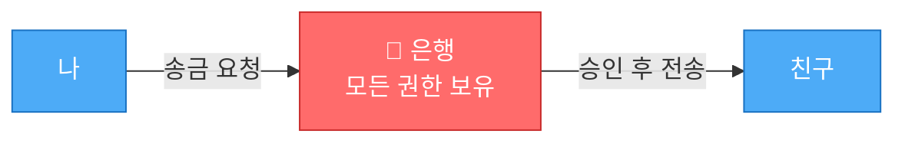
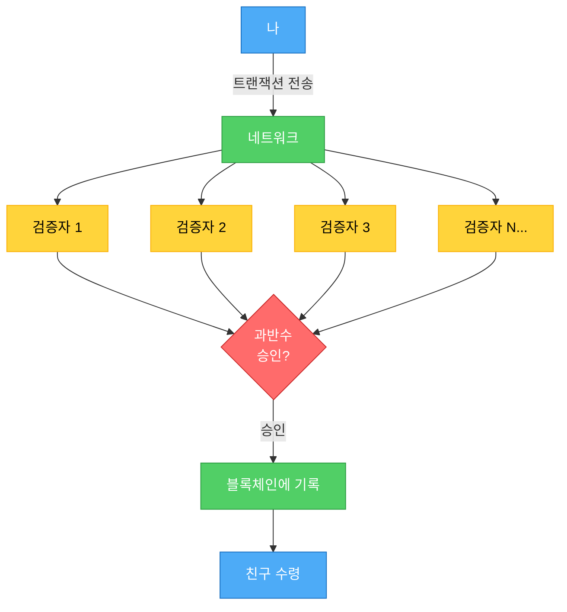
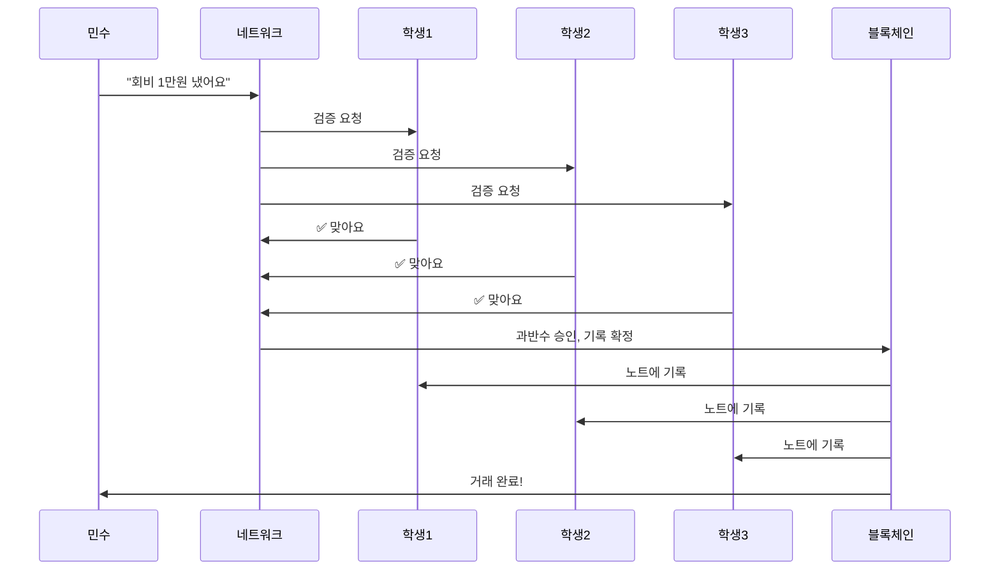
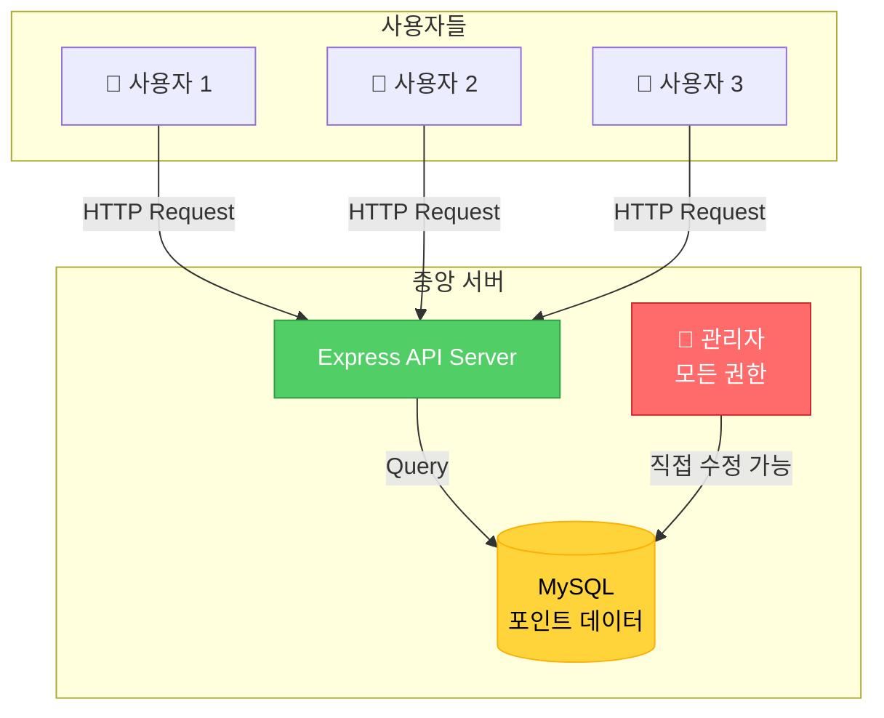
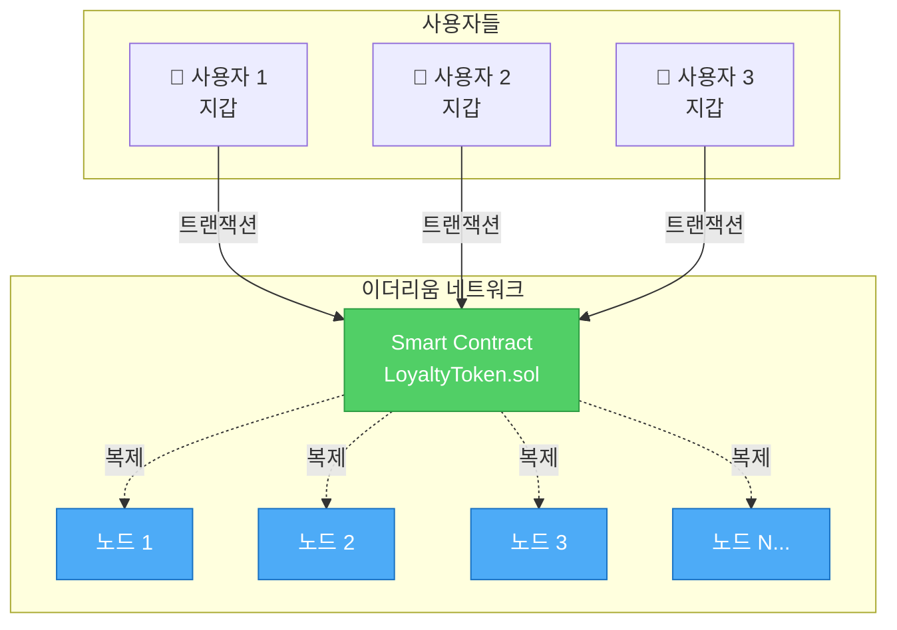
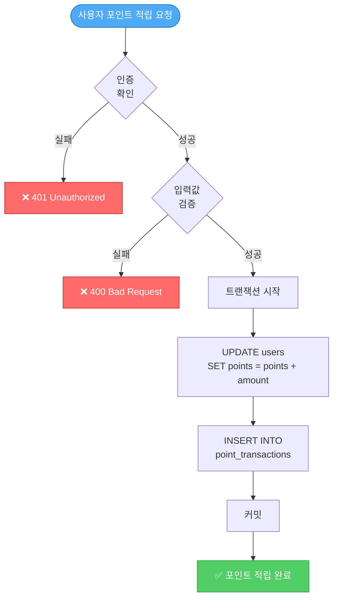
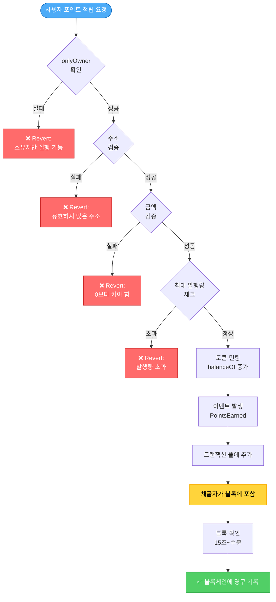
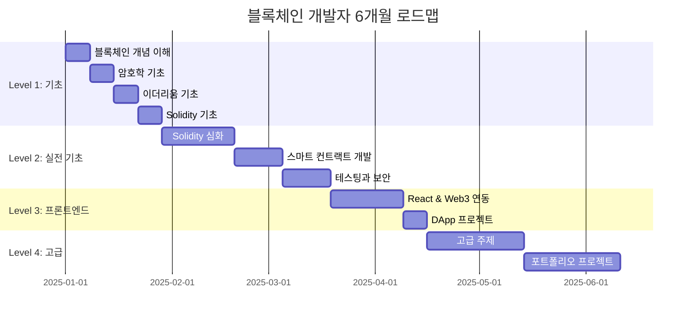
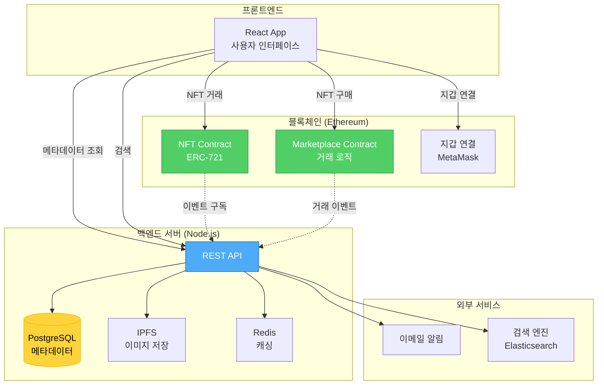

# 블록체인 초보자를 위한 쉬운 설명 + 실전 소스 비교

> 중학생도 이해할 수 있는 블록체인 설명과 실제 현업 개발자들이 사용하는 코드 비교

---

## 📚 목차
1. [5분만에 이해하는 블록체인](#1-5분만에-이해하는-블록체인)
2. [일상 생활로 이해하는 블록체인](#2-일상-생활로-이해하는-블록체인)
3. [실전! 백엔드 vs 블록체인 소스 코드 비교](#3-실전-백엔드-vs-블록체인-소스-코드-비교)
4. [현업 개발자들의 실제 프로젝트 구조](#4-현업-개발자들의-실제-프로젝트-구조)
5. [단계별 학습 로드맵](#5-단계별-학습-로드맵)

---

## 1. 5분만에 이해하는 블록체인

### 🎯 블록체인을 한 문장으로

> **"여러 사람이 같은 공책을 나눠 가지고, 새로운 내용을 쓸 때마다 모두가 확인하고 승인하는 시스템"**

### 🏦 은행 vs 블록체인 (가장 쉬운 비유)

#### 은행 시스템 (중앙화)



**문제점:**
- ❌ 은행이 문을 닫으면 송금 불가
- ❌ 은행이 수수료 마음대로 결정
- ❌ 은행을 믿어야만 함
- ❌ 은행이 거래를 거부할 수 있음

#### 블록체인 시스템 (탈중앙화)



**장점:**
- ✅ 24시간 365일 작동
- ✅ 수수료가 정해져 있음
- ✅ 코드를 믿으면 됨
- ✅ 누구도 거래를 막을 수 없음

### 🔗 블록체인의 핵심 3가지 (초간단 설명)

| 핵심 개념 | 초간단 설명 | 현실 비유 |
|---------|-----------|----------|
| **블록** | 거래 내역을 담는 상자 | 📦 택배 상자 |
| **체인** | 상자들을 끈으로 연결 | 🔗 체인으로 연결된 상자들 |
| **분산** | 모두가 복사본을 가짐 | 📱 단톡방 (모두가 대화 내역 보유) |

#### 블록체인 구조 시각화

```mermaid
graph LR
    subgraph Block1["블록 #1 (제네시스)"]
        direction TB
        B1H["해시: 0x000abc"]
        B1D["데이터:<br/>민수 → 철수: 100원"]
        B1P["이전 해시: 0"]
        B1T["타임스탬프"]
    end

    subgraph Block2["블록 #2"]
        direction TB
        B2H["해시: 0x000def"]
        B2D["데이터:<br/>영희 → 민수: 50원"]
        B2P["이전 해시: 0x000abc"]
        B2T["타임스탬프"]
    end

    subgraph Block3["블록 #3"]
        direction TB
        B3H["해시: 0x000ghi"]
        B3D["데이터:<br/>철수 → 영희: 75원"]
        B3P["이전 해시: 0x000def"]
        B3T["타임스탬프"]
    end

    Block1 ==>|체인으로 연결| Block2
    Block2 ==>|체인으로 연결| Block3
    Block3 -.->|계속 이어짐| Block4[...]

    style Block1 fill:#4dabf7,stroke:#1971c2,color:#fff
    style Block2 fill:#51cf66,stroke:#2f9e44,color:#fff
    style Block3 fill:#ffd43b,stroke:#fab005,color:#000
```



**핵심 포인트:**
- 각 블록은 이전 블록의 해시를 포함 → 변조 불가능
- 블록 #2를 변조하면 해시가 바뀜 → 블록 #3의 "이전 해시"와 불일치
- 모든 후속 블록을 다시 만들어야 함 → 사실상 불가능

---

## 2. 일상 생활로 이해하는 블록체인

### 📝 케이스 1: 반 회비 관리

#### 기존 방식 (중앙화 - 반장이 관리)

```
문제 상황:
- 반장: "회비 10만원 모았어요"
- 학생들: "정말? 증명은?"
- 반장: "내가 적어둔 노트 보세요" (혼자만 가지고 있음)

위험:
❌ 반장이 노트를 잃어버리면?
❌ 반장이 거짓말하면?
❌ 노트를 몰래 고치면?
```

#### 블록체인 방식 (탈중앙화 - 모두가 기록)

**해결 방법:**
- 반 학생 모두가 같은 노트 복사본 보유
- 새 거래 발생 시 아래 프로세스 진행



**장점:**
- ✅ 한 명이 거짓말 못함 (모두가 가지고 있음)
- ✅ 노트 하나 잃어버려도 문제없음
- ✅ 과거 기록 고치기 불가능

### 🎮 케이스 2: 게임 아이템 거래

#### 기존 게임 시스템

```javascript
// 게임 회사 서버 (중앙화)
class GameServer {
    // 회사가 모든 아이템 소유권 관리
    database = {
        user_items: {
            'player123': ['칼', '방패', '물약']
        }
    }

    transferItem(from, to, item) {
        // 회사가 마음대로 아이템 삭제/생성 가능
        this.database[from].remove(item);
        this.database[to].add(item);
    }
}

문제점:
❌ 게임 회사가 서비스 종료하면 아이템 사라짐
❌ 회사가 마음대로 아이템 복사/삭제 가능
❌ 다른 게임에서 사용 불가
❌ 진짜 내 것이 아님
```

#### NFT 블록체인 시스템

```solidity
// 블록체인 스마트 컨트랙트 (탈중앙화)
contract GameItemNFT {
    // 블록체인에 영구 기록
    mapping(address => uint[]) public ownerToItems;

    function transferItem(address from, address to, uint itemId) public {
        // 조건:
        require(msg.sender == from, "본인만 전송 가능");
        require(ownerToItems[from].includes(itemId), "아이템 없음");

        // 전송 (누구도 취소/삭제 불가)
        ownerToItems[from].remove(itemId);
        ownerToItems[to].push(itemId);
    }
}

장점:
✅ 게임 회사가 망해도 아이템은 내 것
✅ 회사도 마음대로 못 가져감
✅ 다른 게임에서도 사용 가능
✅ 진짜 내 소유
```

### 💰 케이스 3: 해외 송금

#### 은행 송금 (중앙화)

```
한국 → 미국 송금 과정:

1일차 오전:  한국 은행 방문
1일차 오후:  서류 작성, 신분증 확인
2일차:      한국 은행 → 중개 은행 1
3일차:      중개 은행 1 → 중개 은행 2
4일차:      중개 은행 2 → 미국 은행
5일차:      친구 계좌에 입금

비용:
- 송금 수수료: 25,000원
- 중개 수수료: 15,000원
- 환전 수수료: 10,000원
총합: 50,000원 (100만원 송금 시)

소요 시간: 3~5일
```

#### 암호화폐 송금 (블록체인)

```javascript
// 블록체인 송금 (예: 이더리움)
async function sendMoney() {
    const tx = await wallet.sendTransaction({
        to: '친구_지갑주소',
        value: ethers.utils.parseEther('1.0') // 1 ETH
    });

    await tx.wait(); // 블록 확인 대기
    console.log('송금 완료!');
}

비용:
- 가스비: 약 3,000원 (네트워크 상황에 따라 변동)

소요 시간: 15초 ~ 5분
```

| 구분 | 은행 | 블록체인 |
|-----|------|---------|
| **시간** | 3~5일 | 15초~5분 |
| **수수료** | 5만원 (5%) | 3천원 (0.3%) |
| **영업시간** | 평일 9~4시 | 24시간 365일 |
| **필요서류** | 신분증, 서류 작성 | 없음 (지갑만) |
| **취소** | 은행에 요청 가능 | 불가능 |

---

## 3. 실전! 백엔드 vs 블록체인 소스 코드 비교

### 🏪 프로젝트 1: 전자상거래 포인트 시스템

#### 시스템 아키텍처 비교

**백엔드 아키텍처 (중앙화)**



**블록체인 아키텍처 (탈중앙화)**



#### 📱 백엔드 개발자의 코드 (Node.js + Express + MySQL)

```javascript
// ============================================
// 백엔드: 중앙화된 포인트 시스템
// ============================================

// 1. 데이터베이스 스키마 (MySQL)
CREATE TABLE users (
    id INT PRIMARY KEY AUTO_INCREMENT,
    username VARCHAR(50),
    points INT DEFAULT 0,
    created_at TIMESTAMP DEFAULT CURRENT_TIMESTAMP
);

CREATE TABLE point_transactions (
    id INT PRIMARY KEY AUTO_INCREMENT,
    user_id INT,
    amount INT,
    type ENUM('earn', 'spend'),
    description VARCHAR(200),
    created_at TIMESTAMP DEFAULT CURRENT_TIMESTAMP,
    FOREIGN KEY (user_id) REFERENCES users(id)
);

// 2. 서버 코드 (Node.js + Express)
const express = require('express');
const mysql = require('mysql2/promise');
const app = express();

// DB 연결
const db = await mysql.createConnection({
    host: 'localhost',
    user: 'root',
    password: 'password',
    database: 'ecommerce'
});

// 포인트 적립 API
app.post('/api/points/earn', async (req, res) => {
    const { userId, amount, description } = req.body;

    try {
        // 트랜잭션 시작
        await db.beginTransaction();

        // 1. 포인트 증가
        await db.query(
            'UPDATE users SET points = points + ? WHERE id = ?',
            [amount, userId]
        );

        // 2. 거래 내역 기록
        await db.query(
            'INSERT INTO point_transactions (user_id, amount, type, description) VALUES (?, ?, ?, ?)',
            [userId, amount, 'earn', description]
        );

        // 커밋
        await db.commit();

        res.json({ success: true, message: '포인트 적립 완료' });

    } catch (error) {
        // 에러 시 롤백
        await db.rollback();
        res.status(500).json({ error: '포인트 적립 실패' });
    }
});

// 포인트 사용 API
app.post('/api/points/spend', async (req, res) => {
    const { userId, amount, description } = req.body;

    try {
        await db.beginTransaction();

        // 1. 잔액 확인
        const [user] = await db.query(
            'SELECT points FROM users WHERE id = ?',
            [userId]
        );

        if (user[0].points < amount) {
            return res.status(400).json({ error: '포인트 부족' });
        }

        // 2. 포인트 차감
        await db.query(
            'UPDATE users SET points = points - ? WHERE id = ?',
            [amount, userId]
        );

        // 3. 거래 내역 기록
        await db.query(
            'INSERT INTO point_transactions (user_id, amount, type, description) VALUES (?, ?, ?, ?)',
            [userId, amount, 'spend', description]
        );

        await db.commit();
        res.json({ success: true, message: '포인트 사용 완료' });

    } catch (error) {
        await db.rollback();
        res.status(500).json({ error: '포인트 사용 실패' });
    }
});

// 포인트 내역 조회 API
app.get('/api/points/history/:userId', async (req, res) => {
    const { userId } = req.params;

    const [transactions] = await db.query(
        'SELECT * FROM point_transactions WHERE user_id = ? ORDER BY created_at DESC',
        [userId]
    );

    res.json(transactions);
});

app.listen(3000, () => console.log('서버 실행 중...'));

// ============================================
// 백엔드 방식의 특징
// ============================================
// ✅ 빠른 처리 (밀리초 단위)
// ✅ 무료 또는 저렴한 비용 (서버비만)
// ✅ 유연한 수정 (UPDATE, DELETE 자유)
// ✅ 복잡한 쿼리 가능 (JOIN, GROUP BY 등)
//
// ❌ 회사가 DB 접근 가능 (포인트 조작 가능)
// ❌ 중앙 서버 해킹 위험
// ❌ 회사가 망하면 포인트 사라짐
// ❌ 다른 플랫폼에서 사용 불가
```

#### ⛓️ 블록체인 개발자의 코드 (Solidity + Hardhat)

```solidity
// ============================================
// 블록체인: 탈중앙화된 토큰 시스템
// ============================================

// SPDX-License-Identifier: MIT
pragma solidity ^0.8.20;

// ERC-20 표준 토큰 컨트랙트
contract LoyaltyToken {
    // 상태 변수 (블록체인에 영구 저장)
    string public name = "Loyalty Points";
    string public symbol = "LPT";
    uint8 public decimals = 18;
    uint256 public totalSupply;

    // 주소별 잔액 (mapping은 해시맵과 유사)
    mapping(address => uint256) public balanceOf;

    // 거래 승인 (다른 주소가 대신 사용할 수 있는 금액)
    mapping(address => mapping(address => uint256)) public allowance;

    // 이벤트 (블록체인에 기록되는 로그)
    event Transfer(address indexed from, address indexed to, uint256 value);
    event Approval(address indexed owner, address indexed spender, uint256 value);
    event PointsEarned(address indexed user, uint256 amount, string reason);
    event PointsSpent(address indexed user, uint256 amount, string reason);

    // 컨트랙트 소유자
    address public owner;

    // 생성자 (컨트랙트 배포 시 1회 실행)
    constructor(uint256 initialSupply) {
        owner = msg.sender;
        totalSupply = initialSupply * 10 ** uint256(decimals);
        balanceOf[owner] = totalSupply;
    }

    // 소유자만 실행 가능한 함수 수식어
    modifier onlyOwner() {
        require(msg.sender == owner, "소유자만 실행 가능");
        _;
    }

    // 포인트 적립 (소유자만 가능)
    function earnPoints(address user, uint256 amount, string memory reason) public onlyOwner {
        require(user != address(0), "유효하지 않은 주소");
        require(amount > 0, "0보다 커야 함");

        // 포인트 생성 (민팅)
        totalSupply += amount;
        balanceOf[user] += amount;

        emit PointsEarned(user, amount, reason);
        emit Transfer(address(0), user, amount);
    }

    // 포인트 전송 (사용자가 직접 실행)
    function transfer(address to, uint256 amount) public returns (bool) {
        require(to != address(0), "유효하지 않은 주소");
        require(balanceOf[msg.sender] >= amount, "잔액 부족");

        balanceOf[msg.sender] -= amount;
        balanceOf[to] += amount;

        emit Transfer(msg.sender, to, amount);
        return true;
    }

    // 포인트 사용 (소각)
    function spendPoints(uint256 amount, string memory reason) public {
        require(balanceOf[msg.sender] >= amount, "잔액 부족");

        balanceOf[msg.sender] -= amount;
        totalSupply -= amount;

        emit PointsSpent(msg.sender, amount, reason);
        emit Transfer(msg.sender, address(0), amount);
    }

    // 다른 주소가 대신 전송할 수 있도록 승인
    function approve(address spender, uint256 amount) public returns (bool) {
        allowance[msg.sender][spender] = amount;
        emit Approval(msg.sender, spender, amount);
        return true;
    }

    // 승인된 금액만큼 대신 전송
    function transferFrom(address from, address to, uint256 amount) public returns (bool) {
        require(from != address(0), "유효하지 않은 주소");
        require(to != address(0), "유효하지 않은 주소");
        require(balanceOf[from] >= amount, "잔액 부족");
        require(allowance[from][msg.sender] >= amount, "승인 금액 부족");

        balanceOf[from] -= amount;
        balanceOf[to] += amount;
        allowance[from][msg.sender] -= amount;

        emit Transfer(from, to, amount);
        return true;
    }

    // 잔액 조회 (view = 가스비 없음, 읽기만)
    function getBalance(address account) public view returns (uint256) {
        return balanceOf[account];
    }
}

// ============================================
// 프론트엔드 연동 코드 (ethers.js)
// ============================================
import { ethers } from 'ethers';

// 1. 지갑 연결
const provider = new ethers.providers.Web3Provider(window.ethereum);
await provider.send("eth_requestAccounts", []); // MetaMask 연결
const signer = provider.getSigner();

// 2. 컨트랙트 연결
const contractAddress = "0x742d35Cc6634C0532925a3b844Bc9e7595f0bEb";
const abi = [...]; // 컨트랙트 ABI

const contract = new ethers.Contract(contractAddress, abi, signer);

// 3. 포인트 적립 (관리자가 실행)
async function earnPoints(userAddress, amount, reason) {
    try {
        const tx = await contract.earnPoints(
            userAddress,
            ethers.utils.parseEther(amount.toString()),
            reason
        );

        // 트랜잭션이 블록에 포함될 때까지 대기
        const receipt = await tx.wait();

        console.log('포인트 적립 완료!', receipt.transactionHash);
    } catch (error) {
        console.error('포인트 적립 실패:', error);
    }
}

// 4. 포인트 전송 (사용자가 직접 실행)
async function transferPoints(toAddress, amount) {
    try {
        const tx = await contract.transfer(
            toAddress,
            ethers.utils.parseEther(amount.toString())
        );

        const receipt = await tx.wait();
        console.log('전송 완료!', receipt.transactionHash);
    } catch (error) {
        console.error('전송 실패:', error);
    }
}

// 5. 잔액 조회 (무료, 즉시)
async function getBalance(address) {
    const balance = await contract.balanceOf(address);
    return ethers.utils.formatEther(balance);
}

// 6. 이벤트 구독 (실시간 알림)
contract.on('PointsEarned', (user, amount, reason, event) => {
    console.log(`${user}님이 ${amount} 포인트 획득! 사유: ${reason}`);
});

// ============================================
// 배포 스크립트 (Hardhat)
// ============================================
// scripts/deploy.js
async function main() {
    const [deployer] = await ethers.getSigners();

    console.log("배포 계정:", deployer.address);
    console.log("계정 잔액:", (await deployer.getBalance()).toString());

    // 컨트랙트 배포
    const LoyaltyToken = await ethers.getContractFactory("LoyaltyToken");
    const token = await LoyaltyToken.deploy(1000000); // 초기 공급량 100만개

    await token.deployed();

    console.log("컨트랙트 주소:", token.address);
}

main()
    .then(() => process.exit(0))
    .catch((error) => {
        console.error(error);
        process.exit(1);
    });

// ============================================
// 블록체인 방식의 특징
// ============================================
// ✅ 투명성 (모든 거래 기록 공개)
// ✅ 불변성 (한번 기록되면 수정 불가)
// ✅ 탈중앙화 (회사도 마음대로 못 바꿈)
// ✅ 다른 플랫폼 연동 가능 (표준 ERC-20)
// ✅ 회사가 망해도 토큰은 유지
//
// ❌ 느린 처리 (블록 생성 대기: 15초~수분)
// ❌ 가스비 발생 (트랜잭션당 수천원)
// ❌ 복잡한 쿼리 불가 (JOIN 같은 기능 없음)
// ❌ 배포 후 수정 불가 (버그 수정 어려움)
```

### 📊 코드 비교 요약

| 항목 | 백엔드 (Node.js) | 블록체인 (Solidity) |
|-----|-----------------|-------------------|
| **코드 길이** | 약 100줄 | 약 150줄 |
| **언어** | JavaScript | Solidity |
| **데이터 저장** | MySQL (중앙 서버) | 블록체인 (분산) |
| **수정 가능** | ✅ 언제든 UPDATE/DELETE | ❌ 불가능 |
| **처리 속도** | 1~10ms | 15초~수분 |
| **비용** | 서버비 (월 5만원) | 가스비 (건당 3천원) |
| **배포** | git push → 재배포 | 새 주소로 재배포 |
| **접근 제어** | 서버 관리자 | 스마트 컨트랙트 코드 |

#### 포인트 적립 프로세스 비교

**백엔드 방식**



**블록체인 방식**



**주요 차이점:**
- 백엔드: 즉시 커밋, DB에 저장 (밀리초)
- 블록체인: 채굴 대기, 블록에 포함 (15초~수분)
- 백엔드: 에러 시 롤백 가능
- 블록체인: 에러 시 가스비는 소모됨

---

## 4. 현업 개발자들의 실제 프로젝트 구조

### 🏗️ 백엔드 프로젝트 구조 (실제 회사)

```
ecommerce-backend/
│
├── src/
│   ├── controllers/          # API 엔드포인트 로직
│   │   ├── userController.js
│   │   ├── pointController.js
│   │   └── orderController.js
│   │
│   ├── models/               # 데이터베이스 모델
│   │   ├── User.js
│   │   ├── Point.js
│   │   └── Order.js
│   │
│   ├── routes/               # API 라우팅
│   │   ├── userRoutes.js
│   │   ├── pointRoutes.js
│   │   └── orderRoutes.js
│   │
│   ├── middleware/           # 미들웨어 (인증, 로깅 등)
│   │   ├── auth.js
│   │   ├── validation.js
│   │   └── errorHandler.js
│   │
│   ├── services/             # 비즈니스 로직
│   │   ├── pointService.js
│   │   └── orderService.js
│   │
│   ├── config/               # 설정 파일
│   │   ├── database.js
│   │   └── redis.js
│   │
│   └── utils/                # 유틸리티 함수
│       ├── logger.js
│       └── validator.js
│
├── tests/                    # 테스트 코드
│   ├── unit/
│   └── integration/
│
├── .env                      # 환경 변수
├── package.json
└── docker-compose.yml        # Docker 설정
```

#### 실제 사용되는 기술 스택

```javascript
// package.json
{
  "dependencies": {
    "express": "^4.18.2",           // 웹 프레임워크
    "mysql2": "^3.6.0",             // MySQL 드라이버
    "sequelize": "^6.32.1",         // ORM (객체-관계 매핑)
    "redis": "^4.6.7",              // 캐싱
    "jsonwebtoken": "^9.0.2",       // JWT 인증
    "bcrypt": "^5.1.1",             // 비밀번호 암호화
    "joi": "^17.9.2",               // 입력 검증
    "winston": "^3.10.0",           // 로깅
    "dotenv": "^16.3.1"             // 환경 변수 관리
  },
  "devDependencies": {
    "jest": "^29.6.2",              // 테스트 프레임워크
    "supertest": "^6.3.3",          // API 테스트
    "nodemon": "^3.0.1"             // 개발 서버 자동 재시작
  }
}
```

### ⛓️ 블록체인 프로젝트 구조 (실제 DApp)

```
defi-dapp/
│
├── contracts/                # 스마트 컨트랙트 (Solidity)
│   ├── tokens/
│   │   ├── LoyaltyToken.sol
│   │   └── GovernanceToken.sol
│   │
│   ├── core/
│   │   ├── StakingPool.sol
│   │   ├── LiquidityPool.sol
│   │   └── Governance.sol
│   │
│   ├── libraries/            # 재사용 가능한 라이브러리
│   │   └── SafeMath.sol
│   │
│   └── interfaces/           # 인터페이스 정의
│       └── IERC20.sol
│
├── scripts/                  # 배포 및 관리 스크립트
│   ├── deploy.js
│   ├── upgrade.js
│   └── verify.js
│
├── test/                     # 컨트랙트 테스트
│   ├── LoyaltyToken.test.js
│   └── StakingPool.test.js
│
├── frontend/                 # 프론트엔드 (React)
│   ├── src/
│   │   ├── components/
│   │   │   ├── WalletConnect.jsx
│   │   │   ├── TokenBalance.jsx
│   │   │   └── TransactionHistory.jsx
│   │   │
│   │   ├── hooks/            # React Hooks
│   │   │   ├── useContract.js
│   │   │   └── useWallet.js
│   │   │
│   │   ├── utils/
│   │   │   ├── web3.js
│   │   │   └── contracts.js
│   │   │
│   │   └── abi/              # 컨트랙트 ABI
│   │       └── LoyaltyToken.json
│   │
│   └── package.json
│
├── hardhat.config.js         # Hardhat 설정
├── .env                      # 개인키, API 키 등
└── package.json
```

#### 실제 사용되는 기술 스택

```javascript
// package.json (블록체인 프로젝트)
{
  "dependencies": {
    // 스마트 컨트랙트 개발
    "hardhat": "^2.17.0",
    "@nomicfoundation/hardhat-toolbox": "^3.0.0",
    "@openzeppelin/contracts": "^4.9.3",  // 검증된 컨트랙트 라이브러리

    // 프론트엔드 블록체인 연동
    "ethers": "^6.7.1",                   // 블록체인 상호작용
    "wagmi": "^1.3.10",                   // React Hooks for Ethereum
    "viem": "^1.6.0",                     // 경량 web3 라이브러리

    // 지갑 연결
    "web3modal": "^1.9.12",
    "@rainbow-me/rainbowkit": "^1.0.8",

    // 프론트엔드
    "react": "^18.2.0",
    "next.js": "^13.4.19",
    "tailwindcss": "^3.3.3"
  },
  "devDependencies": {
    "@nomicfoundation/hardhat-chai-matchers": "^2.0.0",
    "chai": "^4.3.8",
    "solidity-coverage": "^0.8.4",
    "hardhat-gas-reporter": "^1.0.9"
  }
}
```

### 🔄 실제 개발 워크플로우 비교

#### 백엔드 개발 워크플로우

```bash
# 1. 개발
npm run dev                    # 로컬 서버 실행
# 코드 수정
# 브라우저에서 테스트

# 2. 테스트
npm test                       # 단위 테스트 실행

# 3. 배포
git add .
git commit -m "포인트 시스템 추가"
git push origin main

# 4. 자동 배포 (CI/CD)
# GitHub Actions가 자동으로:
# - 테스트 실행
# - Docker 이미지 빌드
# - AWS EC2에 배포
# - 데이터베이스 마이그레이션

# 5. 모니터링
# CloudWatch로 로그 확인
# Sentry로 에러 추적
```

#### 블록체인 개발 워크플로우

```bash
# 1. 로컬 블록체인 실행
npx hardhat node               # 로컬 테스트넷 실행

# 2. 컨트랙트 컴파일
npx hardhat compile            # Solidity → Bytecode 변환

# 3. 테스트
npx hardhat test               # 컨트랙트 테스트

# 4. 테스트넷 배포
npx hardhat run scripts/deploy.js --network sepolia

# 출력:
# Deploying contracts...
# LoyaltyToken deployed to: 0x5FbDB2315678afecb367f032d93F642f64180aa3
# 가스비 사용: 0.0045 ETH (약 $9)

# 5. 컨트랙트 검증 (Etherscan)
npx hardhat verify --network sepolia 0x5FbDB...

# 6. 메인넷 배포 (신중!)
npx hardhat run scripts/deploy.js --network mainnet
# ⚠️ 한번 배포하면 수정 불가!
# 가스비 사용: 0.15 ETH (약 $300)

# 7. 모니터링
# Etherscan에서 트랜잭션 확인
# Tenderly로 컨트랙트 모니터링
# The Graph로 이벤트 인덱싱
```

---

## 5. 단계별 학습 로드맵

### 📚 블록체인 개발자 되기 (완전 초보 → 취업)



#### Level 1: 기초 다지기 (1~2개월)

```
1주차: 블록체인 개념 이해
- ✅ Bitcoin 백서 읽기
- ✅ 블록, 해시, 체인 이해하기
- ✅ 간단한 블록체인 JavaScript로 구현

2주차: 암호학 기초
- ✅ 해시 함수 (SHA-256)
- ✅ 공개키/개인키 암호화
- ✅ 디지털 서명

3주차: 이더리움 기초
- ✅ MetaMask 설치 및 사용
- ✅ 테스트넷에서 거래 해보기
- ✅ Etherscan 사용법

4주차: Solidity 기초
- ✅ Remix IDE에서 첫 컨트랙트 작성
- ✅ 변수, 함수, 제어문
- ✅ 간단한 토큰 만들기
```

#### Level 2: 실전 기초 (2~3개월)

```
5~8주차: Solidity 심화
- ✅ Mapping, Struct, Array
- ✅ 이벤트와 로깅
- ✅ 상속과 인터페이스
- ✅ OpenZeppelin 라이브러리 사용

9~10주차: 스마트 컨트랙트 개발
- ✅ ERC-20 토큰 만들기
- ✅ ERC-721 NFT 만들기
- ✅ 간단한 DeFi 프로토콜

11~12주차: 테스팅과 보안
- ✅ Hardhat으로 테스트 작성
- ✅ 일반적인 보안 취약점 학습
  - Reentrancy 공격
  - Integer Overflow
  - Front-running
```

#### Level 3: 프론트엔드 연동 (1~2개월)

```
13~16주차: DApp 개발
- ✅ React 기초
- ✅ ethers.js로 컨트랙트 연동
- ✅ 지갑 연결 (MetaMask, WalletConnect)
- ✅ 트랜잭션 전송 및 이벤트 구독

프로젝트:
- ✅ 간단한 토큰 전송 DApp
- ✅ NFT 마켓플레이스
- ✅ 탈중앙화 투표 시스템
```

#### Level 4: 고급 및 취업 준비 (2~3개월)

```
17~20주차: 고급 주제
- ✅ 업그레이드 가능한 컨트랙트 (Proxy Pattern)
- ✅ Gas 최적화 기법
- ✅ Layer 2 솔루션 (Polygon, Arbitrum)
- ✅ 크로스체인 브릿지

21~24주차: 포트폴리오 프로젝트
- ✅ DeFi 프로토콜 (Staking, Yield Farming)
- ✅ GameFi (블록체인 게임)
- ✅ DAO (탈중앙화 자율 조직)

취업 준비:
- ✅ GitHub 포트폴리오 정리
- ✅ 기술 블로그 작성
- ✅ 오픈소스 기여
- ✅ 해커톤 참여
```

### 🎯 실습 프로젝트 추천 (난이도순)

| 프로젝트 | 난이도 | 학습 내용 | 예상 시간 |
|---------|-------|----------|----------|
| **간단한 블록체인 구현** | ⭐ | 블록, 해시, 체인 개념 | 1주 |
| **ERC-20 토큰** | ⭐⭐ | Solidity 기초, OpenZeppelin | 1주 |
| **투표 DApp** | ⭐⭐ | 스마트 컨트랙트 + 프론트엔드 | 2주 |
| **NFT 마켓플레이스** | ⭐⭐⭐ | ERC-721, IPFS, 복잡한 로직 | 3주 |
| **탈중앙화 거래소 (DEX)** | ⭐⭐⭐⭐ | AMM, 유동성 풀, 고급 수학 | 4주 |
| **Staking 플랫폼** | ⭐⭐⭐⭐ | 토큰 경제학, 보상 계산 | 4주 |

### 💼 취업 시 요구되는 기술

#### 주니어 블록체인 개발자

```
필수:
✅ Solidity 중급 이상
✅ Hardhat/Truffle 사용 경험
✅ Web3.js 또는 ethers.js
✅ React 기초
✅ Git/GitHub 사용

우대:
⭐ 메인넷 배포 경험
⭐ 보안 감사(Audit) 지식
⭐ DeFi 프로토콜 이해
⭐ 오픈소스 기여
```

#### 시니어 블록체인 개발자

```
필수:
✅ 주니어 요구사항 전부
✅ 아키텍처 설계 능력
✅ Gas 최적화 전문성
✅ 보안 전문 지식
✅ 다양한 체인 경험 (Ethereum, BSC, Polygon 등)

우대:
⭐ 블록체인 코어 개발 (Go, Rust)
⭐ Layer 2 개발 경험
⭐ 크로스체인 개발
⭐ 팀 리딩 경험
```

### 📖 추천 학습 자료

#### 무료 자료

```
🌐 온라인 강의:
- CryptoZombies (게임으로 Solidity 배우기)
  → https://cryptozombies.io

- Ethereum.org 공식 문서
  → https://ethereum.org/ko/developers/

- Solidity by Example
  → https://solidity-by-example.org

📚 책:
- "Mastering Ethereum" (무료 온라인)
  → https://github.com/ethereumbook/ethereumbook

- "Solidity 문서" (한글)
  → https://solidity-kr.readthedocs.io

🎥 유튜브:
- Patrick Collins (영어, 최고의 Solidity 강의)
- Dapp University (영어, 초보자 친화적)
- 코드스테이츠 (한글)
```

#### 유료 자료 (투자 가치 있음)

```
💰 강의:
- Udemy "Ethereum and Solidity: The Complete Developer's Guide"
  → $15~20 (할인 시)

- Alchemy University (무료!)
  → https://university.alchemy.com

🏫 부트캠프:
- ChainShot
- ConsenSys Academy
- 코드스테이츠 블록체인 부트캠프
```

---

## 📝 마무리: 백엔드 vs 블록체인 핵심 정리

### 언제 백엔드를 쓰나?

```
✅ 빠른 처리 속도가 필요할 때
✅ 데이터 수정/삭제가 빈번할 때
✅ 비용을 최소화해야 할 때
✅ 복잡한 쿼리가 필요할 때
✅ 개인정보 보호가 중요할 때

예시:
- 소셜 미디어 (인스타그램, 페이스북)
- 전자상거래 (쿠팡, 네이버)
- 스트리밍 (넷플릭스, 유튜브)
- SaaS 서비스 (Notion, Slack)
```

### 언제 블록체인을 쓰나?

```
✅ 투명성이 매우 중요할 때
✅ 중개자 없이 거래하고 싶을 때
✅ 데이터 변조를 막아야 할 때
✅ 탈중앙화가 필요할 때
✅ 다른 플랫폼과 상호운용해야 할 때

예시:
- 암호화폐 (비트코인, 이더리움)
- NFT 마켓플레이스 (OpenSea)
- DeFi (Uniswap, Aave)
- 공급망 관리 (물류 추적)
- 투표 시스템
- 디지털 신원 인증
```

### 하이브리드 접근 (둘 다 사용)

많은 실제 프로젝트는 백엔드 + 블록체인을 함께 사용합니다!

#### NFT 마켓플레이스 하이브리드 아키텍처



**역할 분담:**

| 컴포넌트 | 역할 | 이유 |
|---------|-----|------|
| **블록체인** | NFT 소유권, 거래, 입찰 | 투명성, 불변성 필요 |
| **IPFS** | 이미지/메타데이터 저장 | 탈중앙화 저장소 |
| **백엔드** | 검색, 필터링, 정렬 | 빠른 쿼리 필요 |
| **백엔드** | 사용자 프로필, 좋아요 | 개인정보, 자주 변경 |
| **백엔드** | 이메일, 푸시 알림 | 실시간 알림 필요 |
| **Redis** | 인기 NFT 캐싱 | 성능 최적화 |

**장점:**
- ✅ 블록체인의 신뢰성 (소유권 증명)
- ✅ 백엔드의 빠른 속도 (검색, 필터링)
- ✅ 최적의 사용자 경험
- ✅ 비용 효율적 (중요한 것만 블록체인에)

### 🚀 첫 걸음 시작하기

```javascript
// 1. 오늘 당장 해볼 수 있는 것
// - MetaMask 설치
// - Sepolia 테스트넷에서 무료 ETH 받기
// - Remix IDE에서 첫 컨트랙트 배포

// 2. 이번 주에 해볼 것
// - CryptoZombies Lesson 1~3 완료
// - 간단한 블록체인 JavaScript로 구현
// - Git/GitHub 사용법 익히기

// 3. 이번 달에 해볼 것
// - ERC-20 토큰 만들어보기
// - 간단한 DApp 만들어보기
// - 블록체인 커뮤니티 참여

// 4. 3개월 후 목표
// - 포트폴리오 프로젝트 1개 완성
// - 기술 블로그 글 5개 작성
// - 오픈소스 기여 시작
```

---

**작성일**: 2025-01-08
**버전**: 2.0
**대상**: 블록체인 입문자, 백엔드 개발자의 블록체인 전환

**다음 문서**:
- 블록체인_고급_패턴.md
- DeFi_프로토콜_깊이_파기.md
- 스마트_컨트랙트_보안_가이드.md
